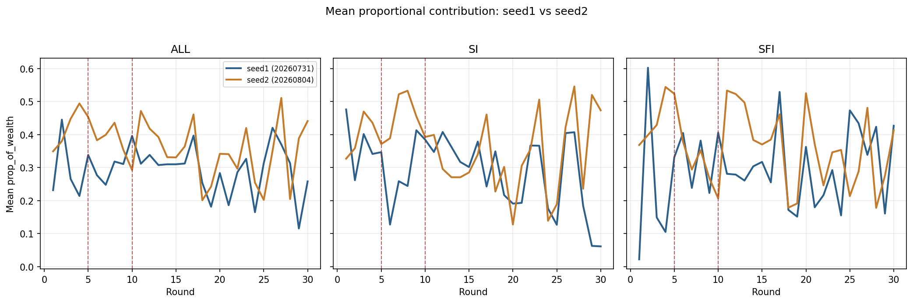
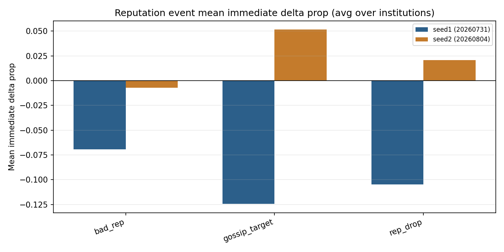
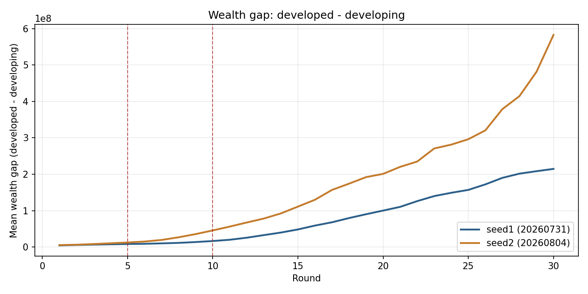
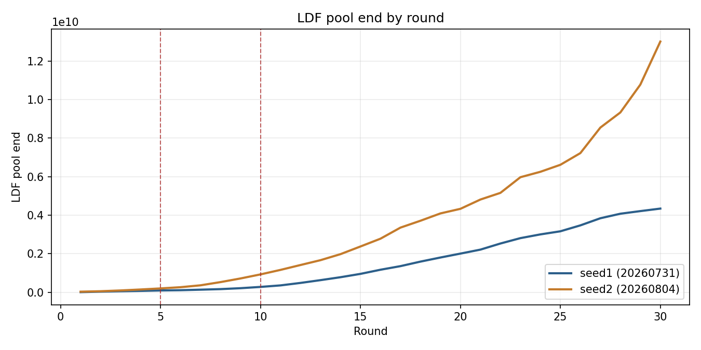
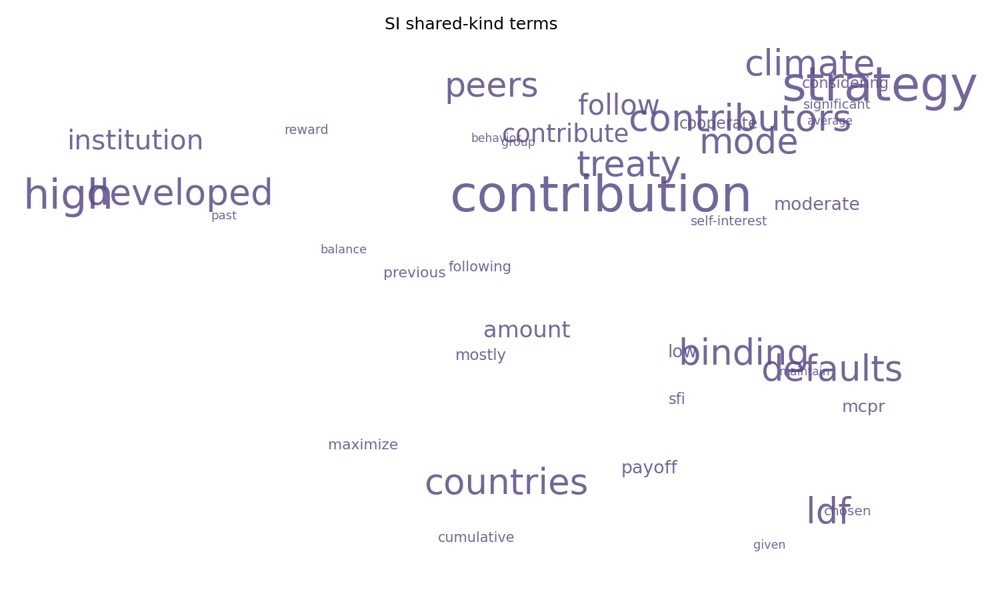

# ELICIT: Emergent LLM Institutions for Climate and International Treaties

[](https://www.python.org/downloads/)
[](LICENSE)
[]()

**ELICIT** (**E**mergent **L**LM **I**nstitutions for **C**limate and **I**nternational **T**reaties) is a research framework and agent-based economic simulation designed to examine cooperation, sanctioning, governance, and climate risk-sharing among heterogeneous Large Language Model (LLM) agents under repeated public goods games and environmental shocks.

---

## Executive Summary & Key Visual Insights

Recent work assumes that social pressure and reputation systems automatically stabilize cooperation in LLM multi-agent societies. **ELICIT** empirical experiments challenge this default claim. Across repeated 30-round replications with 26 heterogeneous agents under climate shocks, democratic updating, and social monitoring (peer scoring, reputation badges, and gossip), we discover that **social monitoring without formal enforcement tools leads to cooperation decay rather than repair**.

### 1. Institutional Cooperation Trajectories

Agents interact under two distinct institutional structures: **Sanctioning Institutions (SI)**, which permit peer punishments and rewards, and **Sanction-Free Institutions (SFI)**, which lack stage-2 peer enforcement. While overall contribution intensity remains moderately positive, cooperation levels vary across seeds while SI and SFI means track closely within each run.


*Figure 1: Round-mean contribution intensity relative to wealth by institution across independent replications (Run A vs. Run B).*

### 2. Social Pressure & Response Dynamics

When non-enforcing (SFI) agents receive bad reputation scores or are targeted in peer gossip bulletins, their subsequent contribution intensity drops on average ($\Delta\mathrm{prop} < 0$). Without formal sanctioning powers, agents respond to public shaming by withdrawing cooperation rather than repairing their standing. In enforcing institutions (SI), responses reverse sign across replications.


*Figure 2: Immediate change in contribution intensity ($\Delta\mathrm{prop}$) following social marks (gossip, bad reputation, reputation drops) across institutions and replications.*

### 3. Global Inequality & Loss & Damage Fund (LDF) Dynamics

Under climate shocks, developed (Global North) agents are assigned to enforcing institutions (SI) while developing (Global South) agents reside in SFI. A persistent Loss & Damage Fund (LDF) collects contributions and pays out climate damages. Despite achieving ~75% damage coverage, **wealth gaps between developed and developing agents continuously widen**, while LDF pool stocks grow far beyond cumulative damage payouts.

<p align="center">
  
  
</p>

*Figure 3: (Left) Developed-minus-developing mean wealth gap widening over time. (Right) Loss & Damage Fund terminal stock balances accumulating beyond cumulative payouts.*

### 4. Emergent LLM Rationales & Rhetoric

Qualitative analysis of LLM agent prompt rationales reveals that post-event adjustments rarely cite reputation repair or moral obligation. Instead, agents frame decisions around opportunistic payoffs, immediate risk, and marginal return calculations.


*Figure 4: Wordcloud of emergent rationale unigrams for Sanctioning Institution (SI) agents, highlighting strategic, incentive-driven language.*

---

## Core Research Architecture

ELICIT models a complex multi-agent climate micro-economy featuring multi-stage interactions, cognitive modules, and institutional evolution.

```
       ┌─────────────────────────────────────────────────────────┐
       │             Round Initialization & Routing              │
       │    (Developed -> SI Institution, Developing -> SFI)     │
       └────────────────────────────┬────────────────────────────┘
                                    │
       ┌────────────────────────────▼────────────────────────────┐
       │     Stage 1: Public Goods Contribution (LLM Decision)   │
       └────────────────────────────┬────────────────────────────┘
                                    │
       ┌────────────────────────────▼────────────────────────────┐
       │      Public Goods Return Distribution & Payoffs         │
       └────────────────────────────┬────────────────────────────┘
                                    │
       ┌────────────────────────────▼────────────────────────────┐
       │  Stage 2: Peer Punishments & Rewards (SI Members Only)  │
       └────────────────────────────┬────────────────────────────┘
                                    │
       ┌────────────────────────────▼────────────────────────────┐
       │ Climate Shocks, LDF Payouts & Subsidy Redistribution   │
       └────────────────────────────┬────────────────────────────┘
                                    │
       ┌────────────────────────────▼────────────────────────────┐
       │ Social Monitoring: ToM Audits, Reputation & Gossip      │
       └────────────────────────────┬────────────────────────────┘
                                    │
       ┌────────────────────────────▼────────────────────────────┐
       │  Constitutional Democracy Session (Periodic Voting)      │
       └─────────────────────────────────────────────────────────┘
```

### Key Framework Components

1. **Heterogeneous Agent Economics**:
   - Initial endowment asymmetry (Developed vs. Developing economic profiles).
   - Wealth tracking, marginal returns on public goods, and private investment options.
2. **Institutional Asymmetry**:
   - **Sanctioning Institution (SI)**: Enables Stage-2 costly peer punishment and reward allocations.
   - **Sanction-Free Institution (SFI)**: Public goods contributions only, without peer sanction mechanisms.
3. **Cognitive & Social Information Modules**:
   - **Theory of Mind (ToM) Audits**: Batched audits evaluating peer consistency and expected strategies.
   - **Peer Gossip System**: Broadcasts public bulletins highlighting agents with low consistency scores or aberrant contribution behaviors.
   - **Reputation Scoring**: Dynamic numerical reputation ratings displayed in agent prompt context.
4. **Climate Shocks & Loss & Damage Fund (LDF)**:
   - Stochastic climate disaster events impacting agent wealth.
   - Dual-purpose Loss & Damage Fund collecting contributions to insure developing agents against shock damage.
5. **Constitutional Democracy**:
   - Periodic voting sessions where agents propose, debate, and vote on institutional rule changes (e.g., subsidy adjustments, voting thresholds, punishment scaling).

---

## Summary of Main Empirical Findings

1. **Social Monitoring Without Enforcement Causes Withdrawal**:
   - In non-enforcing institutions (SFI), receiving negative social marks (gossip or bad reputation scores) leads to significant reductions in subsequent contribution intensity ($\Delta\mathrm{prop} < 0$).
   - Gossip associations are stronger in magnitude than bad-reputation associations.
2. **Replication Sensitivity in Enforcing Institutions**:
   - While SFI agents consistently reduce contributions following negative social marks, SI agents display cross-seed variability (slight drop in Run A, sharp positive increase in Run B).
3. **Stock Accumulation vs. Equity Gaps**:
   - LDF pools accumulate substantial unused reserves over 30 rounds.
   - High coverage ratios (~75%) fail to bridge structural wealth inequality between North and South agents due to uneven initial endowments and risk exposure.
4. **LLM Decision Rationales**:
   - LLM agents operate primarily on short-term payoff maximization and incentive reasoning rather than moral reputation repair or long-term equity goals.

---

## Repository Structure

```text
.
├── docs/                       # Research documentation & TeX sources
│   └── paper/                  # Complete LaTeX paper source & compiled PDF
│       ├── figures/            # High-resolution experiment plots & figures
│       ├── tables/             # LaTeX metrics & summary tables
│       ├── sections/           # Paper LaTeX chapters (Abstract, Results, etc.)
│       └── main.pdf            # Compiled research paper
├── src/                        # Core Python simulation engine
│   ├── main.py                 # Single-run execution entry point
│   ├── run_experiments.py      # Batch experiment sweeps across seeds/conditions
│   ├── core/                   # Engine logic (agent, environment, institution, LDF, params)
│   ├── modules/                # Cognitive/governance (ToM, Gossip, Democracy, Oracle)
│   ├── prompts/                # Prompt builders & template generation
│   ├── parsing/                # Robust JSON response parsers
│   ├── llm/                    # Ollama client wrapper (OpenAI API / reasoning)
│   └── analysis/               # Plot generation & ablation metrics exporters
├── results/                    # Raw simulation JSON outputs
├── analysis_outputs/           # Post-processed plots and CSV metrics (gitignored)
└── dashboard/                  # Interactive HTML/JS browser visualizer for results
```

---

## Getting Started & Reproducibility

### 1. Installation

Clone the repository and install the dependencies:

```bash
git clone https://github.com/uzairlol/ELICIT-fyp.git
cd ELICIT-fyp
pip install -r requirements.txt
```

### 2. LLM Setup (Ollama)

ELICIT runs against local LLM models using [Ollama](https://ollama.ai/).

Pull the default base model:

```bash
ollama pull llama3.1:8b
```

Recommended Workstation Server Environment (e.g. NVIDIA GPU):

```powershell
$env:OLLAMA_NUM_PARALLEL = "1"
ollama serve
```

*Note: You can tune model hardware acceleration settings in `src/core/parameters.py` (`OLLAMA_NUM_GPU`, `OLLAMA_NUM_CTX`, `OLLAMA_NUM_PARALLEL`).*

### 3. Running a Single Simulation

Run a default simulation run with Llama 3.1:

```bash
python src/main.py
```

Common Command Line Arguments:

```bash
# Custom LLM model
python src/main.py --model-name llama3.1:8b

# Enable Climate Shocks & Loss and Damage Fund (LDF)
python src/main.py --scenario ldf --enable-climate-shocks --enable-ldf

# Change agent counts or round horizon
python src/main.py --num-agents 26 --num-rounds 30

# Baseline comparison with heuristic/random agents
python src/main.py --agent-type Random
```

Results are saved as timestamped JSON files under `results/`. Debug logs detailing prompt/response pairs are placed in `src/debug_logs/`.

### 4. Running Experiment Sweeps & Ablations

To reproduce multi-seed paper experiments and ablation sweeps:

```bash
python src/run_experiments.py --scenario ldf --enable-climate-shocks --enable-ldf
```

Flags for controlled execution:

```bash
# Fast validation run across a single seed
python src/run_experiments.py --quick-compare --seeds 1

# Execute full agent population sweeps only
python src/run_experiments.py --full-only
```

### 5. Figure Generation & Dashboard Visualization

#### Generating Plots & Metrics

To export publication metrics and regenerating paper plots from `results/`:

```bash
# Interactive per-run diagnostic plots
python src/analysis/plot_results.py

# Export aggregated metrics CSVs and PNG figures
python src/analysis/export_ablation_metrics.py
python src/analysis/export_ablation_plots.py

# Rationale unigram wordclouds
python src/analysis/plot_wordcloud.py
```

#### Web Visualizer Dashboard

Launch an interactive visualizer in your browser to inspect agent decision chains, round payoffs, gossip events, and voting results:

1. Open `dashboard/index.html` in any modern Web Browser.
2. Load any JSON file from the `results/` folder to explore round-by-round trajectory timelines.

---

## Citation & Research Paper

If you use ELICIT in your research, please refer to the pre-print document in `docs/paper/main.pdf` or cite:

```bibtex
@article{elicit2026,
  title={Emergent LLM Institutions for Climate and International Treaties},
  author={ELICIT Research Team},
  year={2026},
  journal={Working Paper}
}
```

---

## License

This project is licensed under the MIT License - see the [LICENSE](LICENSE) file for details.
