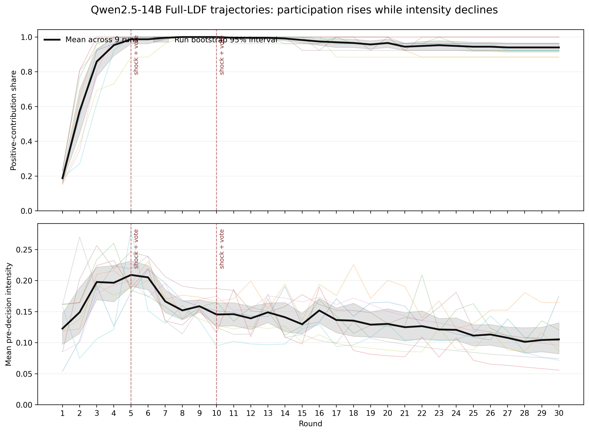
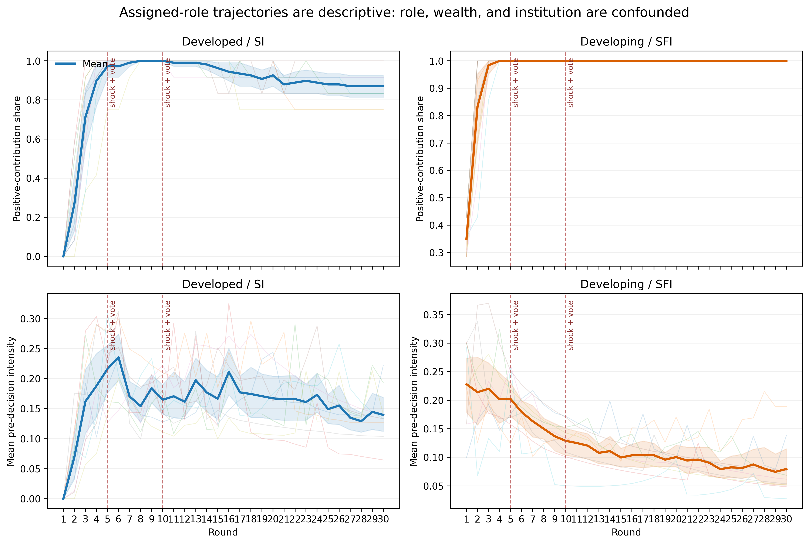
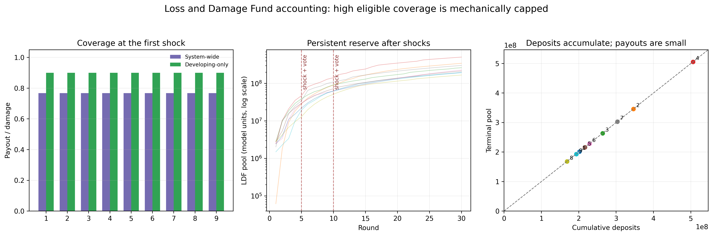
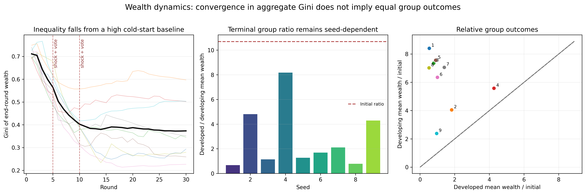
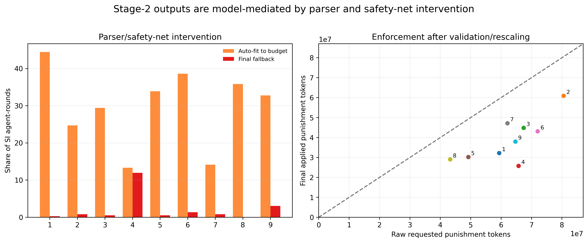
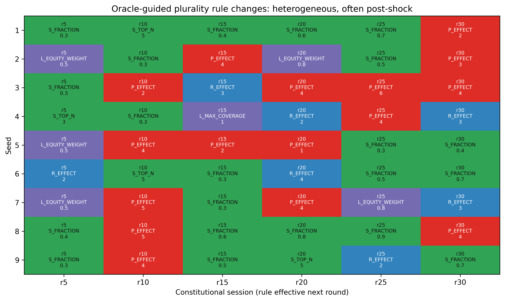
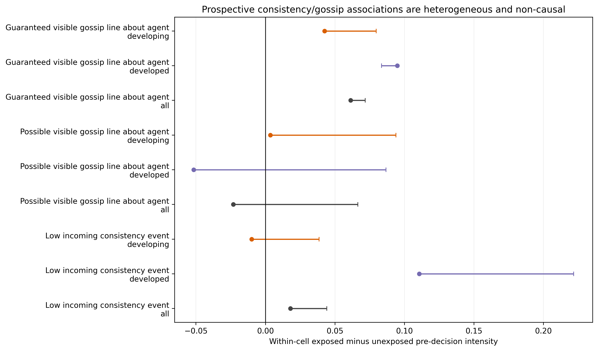
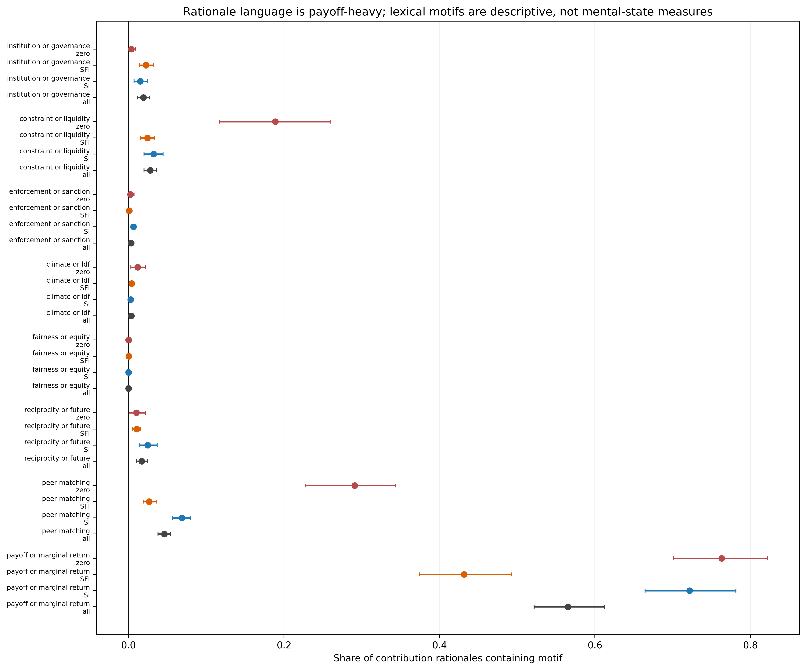

# Qwen2.5-14B in the Full LDF Protocol

## A nine-seed analysis of public-goods participation, climate-risk transfers, enforcement, and institutional adaptation

**Model scope:** `qwen2.5-14b`<br>
**Condition:** `Full_scnldf_sh1_ldf1`<br>
**Independent simulation runs:** 9 (seeds 1–9)<br>
**Population:** 26 agents per round, 12 assigned to the developed/SI role and 14 assigned to the developing/SFI role<br>
**Horizon:** 30 rounds per run<br>
**Raw records:** 270 rounds and 7,020 agent-round observations

This report analyzes the nine Qwen2.5-14B result files in `results/` whose names match `simulation_qwen2.5-14b_Full_scnldf_sh1_ldf1_seed{1..9}_26agents_30rounds_*.json`. It is a fresh analysis of the Qwen files, not an extension of the earlier Llama 3.1 8B seed-1/seed-2 narrative. All inferential summaries treat the nine run files as the top-level replication units. The 7,020 agent-round records are useful for describing within-run dynamics, but they are not 7,020 independent experimental replications: agents share a model, prompts, institutional rules, wealth dynamics, shocks, and social-information events.

The complete machine-generated evidence package is under `analysis_outputs/qwen2_5_14b_9seed/`. The main entry point is `pipeline_summary.json`; the input hashes and software provenance are in `input_manifest.json`; the claim ledger used to check the prose below is `key_claims.json`. Reproducible scripts live in `src/analysis/qwen_9seed/`, and selected tables and figures have been copied into `docs/paper/tables/qwen_9seed/` and `docs/paper/figures/qwen_9seed/` for manuscript use.

## Executive summary

The most robust behavioral result is a divergence between **participation** and **contribution intensity**. Across the nine runs, the average share of agent-round records with a positive contribution was 0.926 (run-bootstrap 95% interval 0.908–0.942), and the eligible-only share was 0.954 (0.946–0.962). This high average, however, hides a pronounced time pattern. The mean positive-contribution share was 0.188 in round 1, 0.573 in round 2, 0.859 in round 3, 0.953 in round 4, and 0.987 in round 5. It reached 1.000 in rounds 8–10 before settling at 0.940 in rounds 27–30. The opening-to-closing comparison therefore shows a 0.297 increase in positive participation (95% paired run-bootstrap interval 0.235–0.358), with all nine runs moving in the same direction. The increase remains visible after removing the cold-start round: rounds 2–4 average 0.795 positive participation versus 0.940 in rounds 28–30, a paired increase of 0.145 (0.071–0.221), again positive in all nine runs.

Intensity moves in the opposite direction once the decision budget is measured correctly. The primary intensity measure divides each contribution by the reconstructed start-of-round wealth cap, rather than by end-of-round wealth or the JSON field named `cooperation_rate`. Mean pre-decision intensity was 0.166 in the opening window and 0.105 in the closing window, a paired change of −0.061 (95% interval −0.094 to −0.028). Excluding the cold-start rounds makes the decline larger, from 0.181 to 0.104, a change of −0.077 (−0.111 to −0.043), negative in every run. The substantive interpretation is that the Qwen agents moved from exploratory non-contribution toward near-universal positive contribution, but the amount contributed relative to their available wealth eventually declined. Calling this “more cooperation” without separating the two dimensions would be misleading.

The second robust result is strong persistence once an agent has contributed. Among eligible consecutive decisions, a positive contribution was followed by another positive contribution 99.98% of the time in the pooled transitions, and the run-level mean was 0.9998 (0.9995–1.000). A zero contribution was followed by a positive contribution only 63.6% of the time at the run level (0.541–0.728). This pattern is consistent with conditional cooperation, strategic memory, or a model-prior tendency to maintain a cooperative trajectory, but it does not by itself establish an internalized social norm. The same transition pattern also means that the late-period decline in intensity is not a collapse of participation: most agents continue to make some positive contribution while contributing a smaller fraction of their decision budget.

The Loss and Damage Fund (LDF) produces a mechanically strong but substantively narrow result. Every Stage-1 public-good contribution is also credited to the LDF; the LDF is not a second, independently chosen payment. Across runs, cumulative deposits range from 168.7 million to 506.0 million model units, with a mean of 270.0 million (213.6–340.1 million). The two scheduled shocks generate 369,000 and 738,000 units of gross damage, and the LDF pays 283,500 and 567,000 respectively in every run. Because only developing agents are eligible, developing-agent damage coverage is exactly 0.900, while the system-wide ratio is 0.768. The latter number is a consequence of dividing by damage from developed agents whom the algorithm does not pay; it is not evidence that the fund covered 76.8% of eligible loss. Terminal reserves remain between 167.9 million and 505.2 million units, so the fund accumulates far more than it disburses over this horizon. The LDF therefore resembles a persistent pooled insurance or risk-financing account, but the data do not identify whether it caused the observed wealth changes.

Wealth inequality falls substantially in the logged trajectories, but the aggregate convergence masks persistent and highly seed-dependent group differences. The mean wealth Gini declines from 0.665 in rounds 1–4 to 0.373 in rounds 27–30, a paired change of −0.292 (−0.364 to −0.213). The initial developed/developing mean-wealth ratio is 10.697 by construction. Its terminal value averages 2.775 (1.410–4.420), with a run range from 0.674 to 8.176; the ratio declines in all nine runs, but the endpoint remains far from equality. Developing agents’ mean wealth ends at 6.20 times their initial mean (4.94–7.26), compared with 1.35 times the initial developed mean (0.80–2.16). This is convergence away from the designed endowment gap, not evidence of a general equalization mechanism.

The mechanism analyses are more cautious. Stage-2 enforcement is heavily mediated by parsing and safety-net intervention: 962 of 3,240 SI agent-round records (29.7%) carry an `auto_fitted_to_budget` flag, while 70 (2.2%) end in a final fallback. The logged `parsing_failures` field is zero everywhere and therefore does not measure intervention. The requested-to-final punishment-token ratio ranges from 0.392 to 0.759 across runs. Democratic sessions are formally active—54 sessions, 1,404 votes, and 54 applied winners—but the system uses plurality voting under Oracle annotations, and 36 sessions occur after the final scheduled shock. ToM and gossip exposure show no stable negative effect on pre-decision intensity once exposure is compared within common run-round-role cells. Low incoming consistency is associated with an intensity difference of 0.018 (95% interval −0.034 to 0.062) overall, and possible visible gossip targeting is associated with a difference of −0.023 (−0.094 to 0.043). The event analysis is associational and threshold-sensitive; it does not support a claim that gossip “backfires.”

Taken together, the results support a computational-social-science story about **trajectory formation under a bundled institutional environment**, not a causal policy evaluation. Qwen agents show rapid movement from low initial participation to high participation, persistent conditional cooperation, and declining intensity. A stylized LDF provides capped insurance to the assigned vulnerable group, while wealth inequality declines without reaching a stable equal outcome. Rule adaptation is heterogeneous and mechanically entangled with enforcement, subsidies, and shock timing. The most defensible paper contribution is therefore a measured account of how a repeated public-goods dilemma with assigned roles, social evaluation, climate shocks, and a pooled loss fund can generate coexistence: high participation, lower intensity, persistent inequality, and substantial seed heterogeneity.

## 1. Data scope, provenance, and integrity

The nine files were selected strictly by the Qwen model alias, the Full-LDF condition, seeds 1–9, 26 agents, and 30 rounds. No Llama file, baseline file, or result under `results/To_Use/` enters the analysis. The input set contains 45,666,346 bytes, 270 round objects, and 7,020 agent objects. The exact file inventory, byte counts, SHA-256 hashes, timestamps, and Python/package versions are recorded in `analysis_outputs/qwen2_5_14b_9seed/input_manifest.json`. The result files do not embed a full run manifest, so the model and condition labels are derived from filenames and corroborated against the logged fields; the exact checkpoint revision, quantization, vLLM version, server flags, and inference commit are not recoverable from the JSON files.

The structural audit passed without an error-level failure. Every run contains rounds 1–30 in order, exactly 26 agents per round with stable IDs `0`–`25`, and matching parent and nested round numbers. SI membership contains 12 agents and SFI membership contains 14; the sets are disjoint and align perfectly with the developed and developing agent groups. All agents are logged with the `LLM` strategy. The SI/SFI institution is not an endogenous choice in this climate/LDF mode: developed agents are hard-routed to SI and developing agents to SFI in `src/core/environment.py`. The logged `institution_reasoning` is fixed synthetic text, not a model-generated preference.

The accounting identities also hold. Stage-1 contributions reconcile to the SI and SFI totals, the logged wealth Gini recomputes from agent-level end wealth to floating-point precision, LDF agent contributions and payouts reconcile to their round totals, and the pool identity `pool_end = pool_start + deposits − payouts` has zero recorded error. Shocks occur at rounds 5 and 10 in every run with severities 0.10 and 0.20. Each run has six constitutional sessions, at rounds 5, 10, 15, 20, 25, and 30. The audit found no missing round or agent keys, no null or non-finite numeric values, and no attrition.

The audit also identifies an important measurement warning. The field named `cooperation_rate` is computed in the environment as the mean of contribution divided by a cap derived from post-payoff end-of-round wealth. It is therefore a source-defined contribution-intensity diagnostic, not the proportion of agents making a positive contribution. The primary analysis instead reconstructs the decision budget as follows. For round 1, initial wealth is `cumulative_payoff − payoff`; for later rounds, start wealth is the previous round’s logged end wealth. The climate-mode cap is `max(0, floor(start wealth))`, and pre-decision intensity is contribution divided by that cap when the cap is positive. A zero cap is treated as structural ineligibility rather than silently recoded as voluntary non-contribution.

## 2. The implemented game and the meaning of the outcomes

The simulation is a repeated public-goods game embedded in a climate/LDF environment. If `c_i,t` is agent i’s contribution in round t, `C_G,t` is the total contribution in assigned institution G, `n_G` is its membership, and `m = 1.6` is the public-good multiplier, each member receives a Stage-1 public-good share

\[
H_{i,t} = \frac{m C_{G,t}}{n_G},
\]

and the climate-mode Stage-1 payoff is `H_i,t − c_i,t`. The marginal public-good return is `m/n_G`, which is 0.1333 for the 12-member SI group and 0.1143 for the 14-member SFI group. Both are below one. Holding peer contributions fixed, a one-unit increase in contribution therefore costs more than the additional public-good benefit returned to the contributor in the current Stage-1 calculation. The Qwen behavior is consequently not adequately summarized as “agents maximize the immediate marginal return.” Repeated interaction, future sanctions, beliefs, social evaluation, the LDF, model priors, and prompt framing can all change the continuation payoff, but this design does not identify which force caused a given contribution.

This is a public-goods social dilemma rather than a literal common-pool resource game. The LDF is a pooled transfer account, not a rivalrous stock whose extraction reduces a future physical resource. The wealth and fund dynamics can be discussed using the language of common-pool governance as an analogy—accumulation, burden sharing, free riding, and redistribution—but the results should not be described as evidence of a tragedy of the commons in the strict Ostromian sense. The architecture does, however, instantiate parts of an Ostrom-inspired repeated-governance setting: repeated interaction, public monitoring through pairwise ToM audits, collective-choice sessions, sanctions and rewards, and bounded parameter adaptation. It lacks several features needed for a strong self-governance claim, including voluntary exit, graduated sanctions, a conflict-resolution process, and nested or polycentric institutions.

Three behavioral outcomes are kept separate throughout. **Positive participation** is `1[contribution > 0]`. **Pre-decision intensity** is contribution divided by the reconstructed start-of-round cap. **Zero contribution** is `1[contribution = 0]`, reported both overall and among eligible agents. The distinction matters because a high participation rate can coexist with a declining contribution fraction, and because a zero-cap observation is not equivalent to a voluntary free-riding decision.

The round ordering also matters. Contributions and sanctions are selected before the shock, LDF payout, belief update, ToM audit, and constitutional vote. ToM scores and reputation in a row reflect the preceding audit and are available to the next action; belief states in a row are updated after that row’s outcome. A rule recorded at round t becomes effective for round t+1. Consequently, the report never treats a round-5 contribution as a response to the round-5 shock, and it describes ToM/gossip results as prospective associations rather than same-round effects.

## 3. Analytical strategy and uncertainty

The raw JSON was not modified. A documented extractor produced separate run, round, agent-round, ToM-edge, sanction-edge, belief, democracy, and text ledgers under `analysis_outputs/qwen2_5_14b_9seed/tables/`. The primary inferential table has one row per seed. Within-run paired changes are computed for each seed first, and the nine resulting changes are then summarized with a percentile bootstrap using 20,000 resamples. Exact two-sided sign-flip p-values are reported as a small-sample symmetry diagnostic; with nine runs, the smallest attainable two-sided p-value under complete sign enumeration is 0.0039. These p-values are not treated as proof of causality, and no agent-level standard error is presented as if 7,020 rows were independent replications.

The main behavioral contrast is the closing window (rounds 27–30) minus the opening window (rounds 1–4). A no-cold-start contrast compares rounds 2–4 with 28–30, and a broader sensitivity check compares rounds 1–5 with 26–30. For scheduled shocks, the pre-shock windows are rounds 2–4 and 7–9, while the post-shock windows begin at t+1 and use rounds 6–8 and 11–13. Because both shock rounds also contain constitutional sessions, these are scheduled discontinuities in observed trajectories, not clean treatment effects.

The primary hypotheses are not adjusted as if nine runs provide a large confirmatory sample. Instead, the report gives effect sizes, run ranges, bootstrap intervals, and sign consistency. Leave-one-seed-out estimates, alternative windows, an end-wealth denominator diagnostic, parser-clean Stage-2 records, and several ToM event thresholds are stored under `robustness/`. The fact that the main participation and intensity contrasts survive these checks is more informative than a single p-value. The fact that ToM threshold choices change the sign of an event coefficient is reported as a limitation rather than hidden through threshold selection.

## 4. Behavioral results

### 4.1 Participation rises rapidly, while intensity declines



*Figure 1. All nine runs are shown as thin lines; the heavy line is the across-run mean and the band is a run-level bootstrap interval. The vertical markers identify scheduled shocks, which coincide with constitutional sessions.*

The trajectory has a clear phase structure. Round 1 is a cold-start phase: the mean positive-contribution share is 0.188, with a run range of 0.154–0.231. The mean rises to 0.573 in round 2 and 0.859 in round 3, then exceeds 0.95 by round 4. The first scheduled shock occurs at round 5, after the round-5 contribution, and the mean positive share is already 0.987 in that round. Participation reaches 1.000 in rounds 8–10 in every run. After the second shock, the mean remains above 0.94 through the end of the horizon, although a small set of zero contributions reappears in some seeds.

The primary paired contrast is reported in Table 1. The increase in positive participation is not merely a pooled row-count effect: all nine seeds have a positive late-minus-early change. The eligible-only contrast is even larger because zero-cap records are removed from the denominator. The participation result is therefore robust as a statement about this model-and-prompt configuration. It does not establish that the same trajectory would occur for a different model, a human population, or a randomized institutional treatment.

| Outcome | Opening mean | Closing mean | Late − early | 95% run-bootstrap interval | Runs favoring increase |
|---|---:|---:|---:|---:|---:|
| Positive-contribution share | 0.643 | 0.940 | +0.297 | 0.235 to 0.358 | 9/9 |
| Eligible positive share | 0.659 | 1.000 | +0.341 | 0.284 to 0.401 | 9/9 |
| Positive share, no cold start | 0.795 | 0.940 | +0.145 | 0.071 to 0.221 | 9/9 |
| Pre-decision intensity | 0.166 | 0.105 | −0.061 | −0.094 to −0.028 | 1/9 |
| Intensity, no cold start | 0.181 | 0.104 | −0.077 | −0.111 to −0.043 | 0/9 |
| Zero-contribution share | 0.357 | 0.060 | −0.297 | −0.357 to −0.236 | 0/9 |

The intensity decline is not an artifact of the round-1 anomaly. Removing round 1 makes the decline larger, and the no-cold-start contrast is negative in all nine runs. It also survives the alternative end-wealth diagnostic, which produces an even larger negative change of −0.109 (−0.149 to −0.064). The correct interpretation is a shift from exploratory, high-intensity contributions toward broad but lower-intensity participation.

Table 2 shows why a pooled average should not be allowed to stand in for the whole nine-seed evidence. The runs share the broad participation and intensity pattern, but their terminal wealth ratios and parser intervention rates differ substantially.

| Seed | Mean positive share | Mean intensity | Early Gini | Late Gini | Terminal developed/developing ratio | LDF deposits (million) | Auto-fit share |
|---:|---:|---:|---:|---:|---:|---:|---:|
| 1 | 0.941 | 0.145 | 0.663 | 0.280 | 0.674 | 201.9 | 44.4% |
| 2 | 0.922 | 0.173 | 0.713 | 0.603 | 4.814 | 346.5 | 24.7% |
| 3 | 0.938 | 0.151 | 0.620 | 0.346 | 1.150 | 264.1 | 29.4% |
| 4 | 0.968 | 0.124 | 0.616 | 0.506 | 8.176 | 506.0 | 13.3% |
| 5 | 0.941 | 0.162 | 0.642 | 0.262 | 1.278 | 216.7 | 33.9% |
| 6 | 0.918 | 0.148 | 0.652 | 0.226 | 1.690 | 229.0 | 38.6% |
| 7 | 0.927 | 0.129 | 0.646 | 0.358 | 2.114 | 303.5 | 14.2% |
| 8 | 0.869 | 0.122 | 0.701 | 0.275 | 0.789 | 168.7 | 35.8% |
| 9 | 0.910 | 0.118 | 0.731 | 0.504 | 4.293 | 193.6 | 32.8% |

*Table 2. Run-level heterogeneity. Gini values are averaged over the stated opening or closing window; intensity is the run mean of pre-decision intensity; LDF deposits are cumulative model units shown in millions.*

### 4.2 Conditional persistence is much stronger than unconditional re-entry

The transition table provides a more game-theoretic view of the repeated interaction. Among 6,259 eligible positive-to-positive transitions, 99.98% remain positive. Among 296 transitions that follow a zero contribution, 60.14% are followed by a positive contribution in the pooled records, and the mean of the nine run-level re-entry rates is 63.61% (bootstrap interval 0.541–0.728). The run-level positive-after-positive rate is 0.9998 (0.9995–1.000). There are 213 zero-contribution episodes across the nine runs; their mean duration ranges from 1.25 to 4.08 rounds, with a maximum observed duration of 20 rounds.

This pattern is consistent with a repeated game in which past actions matter, but it does not distinguish among several mechanisms. The model receives previous-round peer data, belief states, reputation summaries, and a filtered gossip bulletin. It also receives a self-interest instruction and a synthetic climate-role context. Consequently, the transition result supports the narrower statement that behavior is highly path dependent and that a prior positive action is followed by continued positive action. It does not identify reciprocity, reputational repair, or norm internalization as the unique mechanism.

Free-riding is nevertheless present in a measurable form. Across all agent-rounds, 7.39% are zero-contribution records in a round where at least one peer contributed (run-bootstrap interval 0.058–0.092). The corresponding rate is 9.07% in the developed/SI role and 2.78% in the developing/SFI role. These are descriptive peer-free-riding episodes, not estimates of a private payoff gain: the current-round public good is created for all institution members, and the decision is made before current peer contributions are revealed.

### 4.3 Assigned roles produce different trajectories, but not an identified institution effect



*Figure 2. Role-stratified trajectories. “SI” and “SFI” are assigned climate roles, not freely selected institutions.*

The developed/SI group has an overall positive-contribution share of 0.872 (0.838–0.903) and a mean pre-decision intensity of 0.162 (0.147–0.176). The developing/SFI group has a positive share of 0.972 (0.966–0.978) and an intensity of 0.125 (0.108–0.139). The difference in intensity is not a clean institutional treatment effect. It is bundled with initial wealth, vulnerability, historical-emissions metadata, contribution-capacity metadata, group size, sanction access, LDF eligibility, and role-specific prompts. The paper should use phrases such as “the assigned SI role” and “the assigned SFI role,” not “SI caused” or “SFI caused.”

The temporal contrast is nevertheless substantively interesting. SI positive participation rises from 0.470 in the opening window to 0.870 in the closing window, a paired change of +0.400 (0.303–0.493). SFI positive participation rises from 0.792 to 1.000, a change of +0.208 (0.169–0.254). Intensity moves differently: SI changes from 0.103 to 0.137, with a small, sign-inconsistent change of +0.034 (−0.016 to 0.079), while SFI intensity falls from 0.216 to 0.080, a change of −0.135 (−0.181 to −0.083). Eight of nine runs show the SFI intensity decline. The most defensible reading is that the two assigned roles occupy different points in the contribution/wealth space and respond differently to the same bundled protocol.

The payoff accounting helps explain why the roles should not be collapsed. Across all agent-rounds, 92.76% have a positive Stage-1 payoff (0.909–0.944), and 78.75% have a positive total round payoff (0.749–0.830). The corresponding total-positive-payoff share is 61.05% for developed/SI agents and 93.92% for developing/SFI agents. Stage-2 sanctions, rewards, subsidies, and the different wealth regimes make total payoffs diverge even when public-good participation is high. Because punishment destroys payoff units for senders and targets while rewards are comparatively balanced, this pattern is a property of the implemented institution, not a discovered preference parameter.

### 4.4 The public-goods accounting creates a useful cooperation puzzle

The public-good multiplier and group sizes imply marginal returns below one in both institutions, yet aggregate Stage-1 net payoff is positive across most agent-rounds. This is not a contradiction. The marginal-return calculation holds peer contributions fixed, while the observed group contribution total can be large enough that each member’s realized public-good share exceeds their own contribution. The result is a repeated social dilemma in which a myopic deviation argument and an equilibrium-level payoff calculation point in different directions.

The game-theory implication is that observed positive contributions are evidence about the model’s generated behavior under history, prompts, and institutional expectations, not proof that the agents have a stable cooperative utility function. A Qwen rationale such as “maximizing individual payoff through balanced contribution and potential return” is a generated explanation, not a revealed preference parameter. Conversely, a zero contribution described as “initial free-riding to assess others’ contributions” is evidence that the model uses strategic language around a cold start, not proof that the agent possesses a human-like theory of mind.

## 5. Scheduled shocks and the loss-and-damage mechanism

### 5.1 Shock responses are descriptive discontinuities

Shocks occur deterministically at rounds 5 and 10, with severities 0.10 and 0.20. The first shock produces 369,000 units of gross damage and 283,500 units of LDF payout; the second produces 738,000 and 567,000. Because contributions precede the shock, the first possible behavioral response is round 6. Comparing rounds 2–4 with rounds 6–8, positive participation rises by 0.199 (0.130–0.276), while intensity changes by −0.006 (−0.033 to 0.021). Comparing rounds 7–9 with rounds 11–13, the participation change is −0.003 (−0.013 to 0.004), and the intensity change is −0.014 (−0.027 to −0.002).

These contrasts should not be described as estimated shock effects. Both scheduled shocks coincide with democracy sessions, so a post-shock action can reflect the shock, the LDF transfer, a rule change, or their combination. The second shock follows a period in which participation is already near universal, which also limits the amount of independent variation available for a before/after comparison. The defensible statement is that trajectories remain highly cooperative around the scheduled events, with a small late intensity decline and no clean discontinuity that can be attributed to climate risk alone.

### 5.2 LDF coverage is mechanically high, while redistribution remains limited in scale



*Figure 3. Coverage, pool accumulation, and terminal reserves. The developing-only and system-wide coverage bars use the correct eligibility denominators.*

The LDF is a persistent pooled account. The average cumulative deposit is 270.0 million model units (213.6–340.1 million), while total payout is exactly 850,500 in every run. The developing-agent damage denominator is 945,000 across the two shocks, giving a 0.900 eligible-recipient coverage ratio. The all-agent damage denominator is 1,107,000, giving a 0.768 system-wide ratio. The difference is a direct consequence of eligibility: 12 developed agents suffer damage but are not eligible for payout. Reporting only the 0.768 figure would make the fund look like it underperforms its own 0.90 cap, when the relevant implementation question is what happened to eligible recipients.

The fund’s reserve grows to a mean of 269.1 million units (212.8–339.3 million), with individual terminal pools from 167.9 million to 505.2 million. Payouts equal only 0.168%–0.504% of deposits. The SI role supplies 63.9%–92.9% of total LDF deposits across runs, even though only the SFI/developing role is eligible for payouts. This is a stylized burden-sharing pattern, but it should not be read as a direct measure of emissions responsibility, need, or equitable financing. The source code uses the same Stage-1 contribution as the LDF deposit, restricts eligibility to `agent_group == "developing"`, and does not use the logged `contribution_capacity` or `historical_emissions` fields in the payout formula.

The LDF is therefore best described as a capped, damage-weighted insurance transfer under a common-pool-like accounting arrangement. It creates substantial coverage for eligible modeled damage and leaves a large reserve, but the observed reserve is not evidence that agents consciously prefer future solvency or that the fund improves real-world climate justice. The model does not represent applications, access, pledges, deposits, disbursement politics, adaptation choices, or the governance of the real Fund for Responding to Loss and Damage.

### 5.3 Wealth convergence is substantial but incomplete



*Figure 4. Aggregate Gini, terminal group ratios, and group-specific wealth growth. The initial group ratio is fixed by the designed endowment profiles.*

Mean wealth Gini falls from 0.665 in the opening window to 0.373 in the closing window. The paired decline is −0.292 (−0.364 to −0.213), negative in all nine runs. The terminal top-10% wealth share averages 0.272 (0.228–0.324), and the terminal wealth HHI averages 0.060 (0.051–0.072). These are meaningful distributional changes within the simulated economy.

They should not be attributed to the LDF alone. The initial developed/developing mean-wealth ratio is 10.697, and the terminal ratio averages 2.775 (1.410–4.420), with a range of 0.674–8.176. Developing agents’ mean wealth grows to 6.20 times their initial level, while developed agents’ mean wealth grows to 1.35 times theirs. The ratio therefore narrows in every run, but the large terminal range shows that seed-level paths and within-group inequality remain important. Public-good settlement, sanctions, subsidies, transfers, and endogenous wealth growth all contribute to the observed convergence.

A useful paper sentence is that the simulation exhibits **redistributive convergence without a stable equal-outcome attractor**. That is more precise than saying that the LDF “failed to reduce inequality” or that it “solved inequality.” The data support the first formulation; they do not identify a causal mechanism or a policy conclusion.

## 6. Enforcement, sanctions, and parser-mediated behavior



*Figure 5. Stage-2 parser intervention and the difference between raw requested and final applied punishment tokens.*

Stage-2 sanctions are an important part of the implemented environment, but they are not clean records of unmediated model choices. Across 3,240 SI agent-rounds, 962 records (29.7%) carry an `auto_fitted_to_budget` flag and 70 (2.2%) carry a final fallback flag. Sixty-nine records show a semantic retry. The range of auto-fit incidence is 13.3%–44.4% across seeds, while final fallback incidence ranges from 0% to 11.9%. The ordinary `parsing_failures` field is zero in all 7,020 records, demonstrating why a simple missingness counter is inadequate for this pipeline.

The final-to-raw punishment-token ratio ranges from 0.392 to 0.759, and the overall requested-versus-final discard ratio averages 0.387 (0.319–0.460). SI senders participate in at least one applied sanction or reward in 97.4% of agent-rounds (0.940–0.994), but target concentration remains heterogeneous: the target-allocation HHI ranges from 0.092 to 0.321, with a mean of 0.184 (0.138–0.235). The clean-parser subset contains only 55.3%–85.0% of SI records, depending on the seed. A paper that describes enforcement as pure LLM punishment output would therefore misstate the treatment.

The enforcement mechanism is also economically asymmetric. The source applies a punishment effect that is larger than the sender’s unit cost, while rewards are closer to cost-neutral. This means that enforcement can generate negative total payoffs even when sanction participation is high. The data show 61.1% positive total-payoff records for developed/SI agents versus 93.9% for developing/SFI agents, but the difference is inseparable from the assigned role, wealth, vulnerability, and sanction exposure. The theoretically interesting possibility is that enforcement is a second-order collective-action problem in which monitoring and punishment themselves require resources. The present analysis does not prove that agents understand or cooperate on that second-order problem.

## 7. Democratic adaptation and institutional heterogeneity



*Figure 6. Winning parameter changes by seed and session. Each cell is effective from the following round.*

The constitutional module is active in every run. There are 54 sessions, 1,404 vote records, and 1,404 valid votes. All 54 sessions produce an applied winner. The mean plurality share of the winning proposal is 0.952, but the system uses plurality rather than a majority threshold. Across the 54 winners, 25 change subsidy rules, 16 change punishment-effect rules, 7 change reward-effect rules, and 6 change LDF rules. Forty-six winners increase the current value of their parameter and eight decrease it. The direction is not uniform enough to support a simple “agents always punish” or “agents always subsidize” narrative; the paths are heterogeneous and often adaptive to previous outcomes.

Thirty-six sessions occur after the final scheduled shock, which is four of six sessions per run. A rule adopted at round 15, 20, 25, or 30 cannot affect any realized LDF payout because the last shock is at round 10. The rule may still affect later sanctions, subsidies, or public-good incentives. This timing distinction matters for climate-finance claims: an LDF-equity or coverage rule can be adopted symbolically in the log without ever being tested against a later shock.

The democracy process is also Oracle-conditioned. Voters see synthetic heuristic annotations rather than an objective welfare measure, and the Oracle’s cooperation calculation uses a fixed contribution denominator that is not calibrated to wealth-scaled climate contributions. The appropriate claim is that Qwen agents produced heterogeneous rule changes under an Oracle-guided, plurality-based collective-choice procedure. It is not a clean measure of unassisted group preference, deliberative legitimacy, or welfare improvement.

## 8. ToM, reputation, gossip, and belief states



*Figure 7. Within-run-round-role exposed-minus-unexposed differences in pre-decision intensity. Intervals are run-level bootstrap intervals; the estimates are associational, not causal.*

The ToM module produces 169,650 pairwise evaluator-target scores across the nine runs, corresponding to 25 targets per evaluator in 29 audited rounds per run. Scores are not moral judgments or direct measures of free-riding. They ask the same model whether a target’s generated contribution rationale is consistent with its action. An agent that honestly says it is free-riding can therefore receive a relatively high consistency score. The resulting “reputation” is a peer-average consistency rating, not a human reputation or an independent evaluator score.

The raw records do not contain the live gossip bulletin, its recipient list, or concurrent completion order. The analysis therefore reconstructs exposure bounds from stored ToM edges. A bulletin candidate is an edge with score at or below 7; the five lowest candidates are provisionally selected, with ties at the fifth position treated as ambiguous. Across agents, a possible visible gossip line is present in 88.9% of agent-round exposure records, but a guaranteed “YOU” line is rare, averaging 0.70% of records. The distinction matters because every recipient can see most bulletin lines, while the live visibility of a line about a particular target depends on selection ties and the receiver not being its source.

Within common seed-round-role cells, a low incoming consistency event, defined as a peer-average score below 4, is associated with an intensity difference of 0.018 (95% interval −0.034 to 0.062) overall. For developed/SI agents the difference is 0.111 (−0.042 to 0.332), and for developing/SFI agents it is −0.010 (−0.052 to 0.029). Possible visible gossip targeting is associated with an overall difference of −0.023 (−0.094 to 0.043), a developed/SI difference of −0.052 (−0.149 to 0.035), and a developing/SFI difference of 0.004 (−0.081 to 0.097). The possible-bulletin-receipt event has no meaningful unexposed comparison because nearly all agents can see a bulletin once one exists.

These estimates do not support a robust “reputation backfires” conclusion. They are endogenous, repeated, and confounded by prior behavior; they are measured after the preceding audit and before the current action; and the bulletin is a common information event that creates interference across agents. The threshold sensitivity is itself informative. Across thresholds from 3 to 5, the within-cell difference is mildly positive, while thresholds of 6 and 7 produce negative differences. A result whose sign depends on an analyst-chosen threshold should be presented as a hypothesis about consistency information, not as a discovered causal effect.

The belief-state logs provide a complementary view of the model’s social representation. There are 113,899 sparse trust-label edges, including 27,812 labels classified as free-rider language and 39,632 as cooperative language, alongside labels such as `defector`, `unknown`, `conditional`, `selfish`, `high-contrib`, and `low-contrib`. These labels are free-form model outputs rather than a fixed validated ontology. They show that the simulation maintains a structured social representation, but they do not establish that the representation is accurate or that it causes the next action.

## 9. Reasoning language: evidence about stated explanations, not hidden cognition



*Figure 8. Document-level prevalence of predefined lexical motifs in contribution rationales. Bars are descriptive codebook hits, not psychological measurements.*

The qualitative analysis uses contribution rationales rather than the hard-coded institution reasoning. A predeclared multi-label codebook counts references to payoff or marginal return, peer matching, reciprocity or future rounds, fairness or equity, climate or LDF, enforcement, constraint or liquidity, and institution or governance. Across 7,020 contribution rationales, payoff or marginal-return language appears in 56.5% of documents, with a run-bootstrap interval of 52.2%–61.2%. The rate is 72.2% for developed/SI documents and 43.1% for developing/SFI documents. Peer-matching language appears in 4.6% of all documents but in 29.1% of zero-contribution documents. Constraint or liquidity language appears in 2.8% of all documents and 18.9% of zero-contribution documents. Reciprocity or future-round language appears in 1.7% of all documents.

The contrast between zero and positive actions is consistent with a cold-start strategic pattern: zero actions are disproportionately explained through observing peers, free-riding language, or resource constraints, while positive actions are more often framed through balancing payoff and group returns. It would be too strong, however, to call these texts evidence of intrinsic motivation, human-like reciprocity, or a recovered fairness preference. The default persona explicitly asks agents to maximize cumulative payoff, and the lexical corpus is generated by the same model whose behavior is being measured. The correct computational-social-science claim is that Qwen’s stated explanations are prompt-shaped and action-contingent, and that the explanation vocabulary differs between positive and zero actions.

Fairness/equity terms are nearly absent in the contribution rationales under this codebook—only one of 7,020 documents matched the specified pattern. That result should be treated as a measurement of the current prompts, parser, and regex codebook, not as proof that the model lacks a fairness concept. Belief labels and democracy proposal reasons contain different vocabularies, and a broader human-coded analysis could produce a different estimate.

The text corpus is also highly templated. The 7,020 contribution rationales contain 2,895 unique texts (41.2% unique), with a mean length of 8.45 words; the most common rationale accounts for 318 documents (4.5%). Zero-action rationales are slightly longer than positive-action rationales (9.18 versus 8.39 words on average). By contrast, the institution reasoning has only two unique strings across all 7,020 records, confirming that it is boilerplate rather than an endogenous institutional preference. This lexical repetition is another reason to treat the rationales as evidence about prompt-shaped model behavior, not as independent psychological measurements.

## 10. What the results mean for game theory and computational social science

The first theoretical implication concerns the coexistence of a negative marginal return and high realized cooperation. In the classic public-goods and endogenous-enforcement literature, repeated interaction, conditional cooperation, and sanctions are central explanations for why a one-shot social dilemma can sustain contributions beyond a purely myopic calculation; Ostrom’s design-principle framework supplies a related institutional lens for monitoring, collective choice, and graduated enforcement. This report uses those concepts as interpretive anchors rather than claiming that the Qwen architecture reproduces the human laboratory findings. In a one-shot public-goods stage, zero contribution is locally attractive when the marginal return is below one. In the repeated Qwen protocol, however, positive participation rises from a low cold start to near universality and then remains high. The transition structure—almost perfect persistence after a positive action but only about 64% re-entry after a zero—fits a repeated-game account in which history and expected peer behavior matter. It does not identify whether the relevant continuation value comes from sanctions, reputational information, belief states, the model’s learned language prior, or the interaction of these channels.

The second implication concerns free-riding as a measurable behavior rather than a presumed motive. A zero contribution in a round with positive peer contributions occurs in 7.4% of agent-rounds overall and is more common in the developed/SI role. Yet the same logs also show that most agents eventually contribute and that the aggregate public-good share is large. This is a more nuanced picture than a binary “cooperators versus defectors” dichotomy: the model can display strategic free-riding language in a cold start, rapidly learn or generate a cooperative trajectory, and then reduce contribution intensity as the wealth denominator grows.

The third implication concerns pooled risk financing. The LDF behaves like an insurance pool with a hard coverage cap, a restricted eligibility rule, and a persistent reserve. It provides eligible developing agents with 90% of their modeled damage at the two shocks, but it does not create a rivalrous common resource and does not establish that agents are optimizing long-run fund solvency. The large difference between deposits and payouts shows that the model’s climate-finance mechanism is mostly accumulation in this horizon. A paper can use this result to study the institutional architecture of burden sharing and insurance, but it should not present the simulated payout rule as evidence about the real Fund’s effectiveness.

The fourth implication concerns institutional adaptation. The rule-change module allows the population to modify a bounded parameter set, yet the winners are heterogeneous, plurality-selected, and Oracle-conditioned. The system therefore demonstrates bounded institutional learning rather than a pure emergence of self-governing rules. Ostrom’s design principles are relevant as an analytical lens—collective choice, monitoring, sanctions, and adaptation are all present in some form—but the architecture does not satisfy the stronger conditions required to claim durable Ostromian governance. The appropriate computational-social-science contribution is to show how a rule-adaptation mechanism interacts with a social dilemma under stress, including the possibility that formally adopted rules are post-shock, mechanically inert, or disconnected from the welfare outcome they nominally target.

For literature positioning, the repository’s theory notes on behavioral economics, Ostrom’s mapping to commons governance, and the LDF context are useful starting points: `docs/raw documentation/20260804/theory/24_behavioural_economics_interpretation.md`, `25_ostrom_governing_the_commons_mapping.md`, and `26_ldf_context_and_multi_agent_motivation.md`. They should be treated as conceptual orientation, not as substitutes for verified primary citations in the final manuscript.

Finally, the nine runs demonstrate why seed-level analysis matters. Aggregate cooperation looks high, but terminal wealth ratios range from below one to more than eight, auto-fit incidence ranges from 13% to 44%, and final fallback incidence ranges from zero to almost 12%. A paper based on one or two seeds could easily turn these heterogeneous paths into a false universal story. The nine-seed analysis supports a distributional claim—most runs share the participation and intensity pattern—while also documenting the model’s substantial path dependence and parser-mediated variation.

## 11. Claim-strength matrix

| Candidate statement | Evidence in this analysis | Strength and permitted wording |
|---|---|---|
| Qwen agents move from low initial participation to high participation | Positive share 0.188 in round 1, 0.940 in rounds 27–30; paired change +0.297, 9/9 runs | **Strong descriptive model result.** Say “in these nine Qwen runs.” |
| Participation declines late | Positive share falls from 1.000 around rounds 8–10 to 0.940 at the endpoint | **Descriptive.** Do not call it norm collapse without a norm measure. |
| Contribution intensity declines over the horizon | 0.166 to 0.105; no-cold-start change −0.077, 9/9 runs | **Robust descriptive result** for the reconstructed decision budget. |
| Qwen exhibits conditional cooperation | 99.98% positive-after-positive versus 63.6% positive-after-zero | **Consistent with**, not proof of, conditional cooperation. |
| LDF provides high coverage | 90% of developing-agent damage; 76.8% of all-agent damage | **Mechanical accounting result.** The 76.8% figure is not eligible coverage. |
| LDF reduces inequality | Gini falls and the group ratio narrows in all runs | **Descriptive association only.** No no-LDF counterfactual exists. |
| SI and SFI institutions cause different behavior | Role trajectories differ | **Not identified.** Role, wealth, vulnerability, group size, and eligibility are collinear. |
| Shocks increase cooperation | Round-5 descriptive window rises; round-10 window is flat | **Not identified.** Shock coincides with democracy and has no control condition. |
| Gossip or low reputation reduces contribution | Within-cell intervals cross zero and thresholds change sign | **Exploratory, non-causal.** Do not use “backfires” as a headline claim. |
| Democratic voting improves welfare | Rules change, but Oracle-conditioned plurality outcomes are logged | **Not identified.** Report rule paths, not welfare improvement. |
| Qwen rationales reveal human-like preferences | Lexical motifs differ by action | **Unsupported.** Report stated language, not hidden cognition or stable preferences. |
| Results generalize to humans or the real LDF | No human or policy data | **Unsupported.** Limit claims to the model-and-prompt configuration. |

## 12. Limitations that should appear in the paper

The most important limitation is design confounding. In climate mode, institution is hard-coded from country group. The 12 developed/SI agents and 14 developing/SFI agents differ simultaneously in initial wealth, vulnerability, historical-emissions metadata, contribution-capacity metadata, Stage-2 access, LDF eligibility, group size, and prompt framing. A pure SI effect cannot be estimated from these files. The second limitation is the absence of a control condition. The nine runs are all Full-LDF trajectories; there is no Qwen no-LDF, no-shock, no-gossip, no-ToM, or free-choice comparison. The third is the small number of top-level replications. Nine runs permit transparent run-level uncertainty, leave-one-seed-out checks, and exact sign-flip diagnostics, but they do not provide the precision of a large factorial experiment.

The fourth limitation is measurement. The raw `cooperation_rate` field is not a positive-contribution rate, and the JSON does not store start-of-round wealth, the live gossip bulletin, model revision, or the inference server manifest. The fifth is parser intervention. Auto-fitting and fallback safety nets alter a substantial fraction of Stage-2 outputs, so the observed sanction map is an end-to-end system behavior rather than a pure unmediated model preference. The sixth is temporal confounding: shocks and constitutional sessions coincide at rounds 5 and 10, and a rule adopted after round 10 cannot affect a later LDF payout because no later shock occurs. The seventh is economic calibration. The wealth and currency labels are not calibrated to a real macroeconomic unit, and the LDF omits applications, pledges, access, adaptation choices, and disbursement governance.

There are also implementation details that should be disclosed rather than treated as behavioral findings. The climate-mode `round_number` used in some prompts is reported by the source audit as round 0 because institution choice is bypassed. The subsidy is newly created payoff after punishment costs rather than a transfer from a collected central pool. `contribution_capacity` and `historical_emissions` are logged but do not enter the implemented contribution cap, damage function, or LDF payout formula. The ToM score is an intent-action consistency score, and the LLM-generated rationale is a stated explanation rather than a verified preference or hidden chain of thought. These details are relevant when interpreting the model as a stylized institution, but they should not be turned into psychological claims about the agents.

## 13. Paper-ready contribution and recommended story

A strong paper can organize the results around five empirical propositions. First, repeated interaction in this Qwen configuration produces a rapid participation transition: cold-start free-riding language and zero actions are followed by near-universal positive contribution, with a positive late-minus-early change in all nine runs. Second, the cooperation trajectory is not one-dimensional: conditional persistence remains extremely high while contribution intensity declines. Third, a stylized LDF delivers its capped coverage to eligible developing agents and narrows the designed wealth gap, but it also accumulates a large reserve and operates within a confounded institutional environment. Fourth, enforcement and governance are active but heterogeneous; parser intervention, Oracle conditioning, plurality voting, and post-shock rule changes make formal institutional activity an imperfect proxy for welfare or norm formation. Fifth, the ToM/gossip layer produces measurable social information, but its prospective association with behavior is threshold-sensitive and not robust enough to support a causal “reputation backfires” claim.

That story is stronger than forcing a single dramatic finding. It connects public-goods theory to repeated games, connects loss-and-damage finance to pooled risk sharing and burden incidence, connects wealth dynamics to redistribution and inequality, and connects LLM social modules to computational social science. It also respects the distinction between what the simulation measures and what it metaphorically resembles. The paper can say that a common-pool-like fund creates insurance incidence under a public-goods contribution rule, that assigned roles produce heterogeneous trajectories, and that formal adaptation coexists with uneven outcomes. It should not say that the model proves Ostromian self-governance, human norm internalization, real-world LDF effectiveness, or a causal effect of sanctions, shocks, or gossip.

## 14. Reproducibility and evidence index

The complete pipeline can be rerun from the repository root with the `ml` environment:

```powershell
$env:PYTHONPATH = "src"
& "C:\Users\uzii1\miniconda3\Scripts\conda.exe" run -n ml python -m analysis.qwen_9seed.run_all `
  --results-dir results `
  --output-dir analysis_outputs/qwen2_5_14b_9seed
```

The runner performs input hashing and manifest creation, structural and accounting audits, raw-to-tidy extraction, run-level statistical analysis, persistence diagnostics, robustness checks, claim-ledger generation, and figure rendering. The important derived artifacts are:

- `analysis_outputs/qwen2_5_14b_9seed/input_manifest.json` for file hashes, software versions, and provenance caveats.
- `analysis_outputs/qwen2_5_14b_9seed/audit/run_audit.csv` and `data_quality_checks.csv` for completeness, parser flags, shock checks, and accounting identities.
- `analysis_outputs/qwen2_5_14b_9seed/tables/agent_round.csv` and `round_metrics.csv` for the tidy behavioral and macro tables.
- `analysis_outputs/qwen2_5_14b_9seed/analysis/run_metrics.csv` for the nine independent run summaries.
- `analysis_outputs/qwen2_5_14b_9seed/analysis/primary_contrasts.csv` for paired trajectory and shock-window contrasts.
- `analysis_outputs/qwen2_5_14b_9seed/analysis/reasoning_profile.csv` for text-length, uniqueness, and templating diagnostics.
- `analysis_outputs/qwen2_5_14b_9seed/analysis/event_associations.csv` for the within-cell ToM/gossip associations.
- `analysis_outputs/qwen2_5_14b_9seed/robustness/` for leave-one-seed-out, window, denominator, parser, and threshold sensitivity.
- `analysis_outputs/qwen2_5_14b_9seed/key_claims.json` for the machine-readable ledger used to check numerical statements in this report.

Selected tables and figures are also stored under `docs/paper/tables/qwen_9seed/` and `docs/paper/figures/qwen_9seed/`. No raw result file was overwritten, and no Llama or non-Qwen condition was used for the reported statistics.
