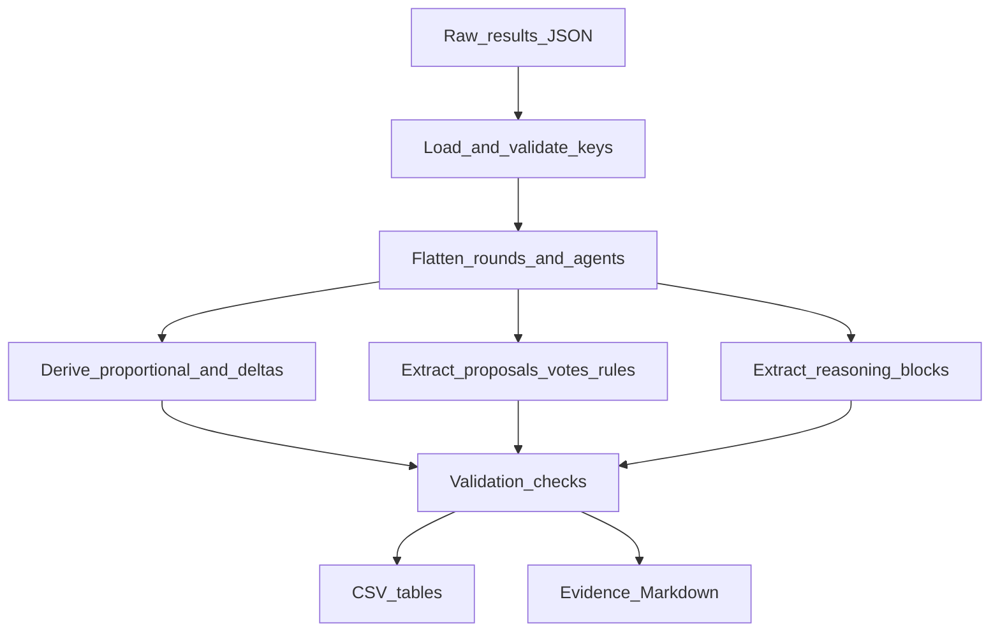

# 03 — Extraction Pipeline (20260731)

How raw JSON becomes analysis tables. No behavioural interpretation.

---

## Entrypoint

```bash
python "docs/raw documentation/20260731/scripts/extract_20260731_results.py"
```

Run from repository root. Relative paths only. Does not modify `results/`.

Script: `docs/raw documentation/20260731/scripts/extract_20260731_results.py`

Canonical input:

`results/To_Use/simulation_llama3.1_8b_Full_scnldf_sh1_ldf1_seed1_26agents_30rounds_20260731_013853.json`

---

## Pipeline steps



### 1. Load and fail-fast validate

- Require top-level list of rounds
- Require round keys: `round_number`, `agents`, membership/contribution aggregates, shock + LDF pool fields
- Require agent keys: `agent_group`, `institution_choice`, `contribution`, `wealth`, `reputation`, `payoff`
- Abort with clear error if missing

### 2. Deterministic ordering

- Rounds sorted by `round_number` ascending
- Agents sorted by numeric `agent_id` ascending

### 3. Flatten → tables

| Output | Construction |
|--------|----------------|
| `agent_metadata.csv` | First observed round per agent (wealth, capacity, vulnerability, emissions) |
| `round_agent_state.csv` | Membership flags, wealth, reputation, shock / democracy flags |
| `contributions.csv` | Raw contribution + analyst proportional columns |
| `fund_state.csv` | Round LDF pool and damage totals |
| `reputation_events.csv` | Reputation + delta vs prior round + `tom_scores` count |
| `proposals.csv` / `votes.csv` / `adopted_rules.csv` | From `constitutional_change` |
| `climatic_shocks.csv` | Shock flags + severity + damage |
| `agent_actions.csv` | Contributions, sanction totals, subsidy, LDF flows, parse markers |
| `payoffs.csv` | Stage and cumulative payoffs |
| `redistribution.csv` | Subsidy + LDF payout/contribution/net transfer |
| `institutional_state.csv` | SI/SFI aggregates + coop/gini |
| `reasoning_blocks.csv` | Non-empty reasoning / belief / proposal texts with evidence IDs |
| `gossip_bulletins.csv` | Header only (field absent) |
| `data_quality_summary.csv` | Validation metrics |

### 4. Evidence IDs

Form: `RB-{round:02d}-A{agent_id}-{kind}`

Kinds: `institution`, `contribution`, `punishment`, `deanonymized_punishment`, `belief_strategy`, `belief_observations`, `proposal_reason`

Index: `evidence/reasoning_block_index.md`  
Issues: `evidence/malformed_or_missing_records.md`

### 5. Relation to existing `src/analysis`

Reuses the same flatten mindset as `export_ablation_metrics.py` (safe casts, filename metadata) but is **not** a wrapper around it, because ablation export omits proposals, full reasoning text, evidence IDs, and data-quality reporting into this documentation tree.

---

## Validation performed (this run)

| Check | Result |
|-------|--------|
| Agent-round rows | 780 PASS (26×30) |
| Unique agents / rounds | 26 / 30 PASS |
| Duplicate (round, agent) | 0 PASS |
| Round range | 1–30 complete PASS |
| Missing rates (contrib/wealth/rep/inst/group) | 0 PASS |
| Negative contributions | 0 PASS |
| Reputation outside [0,10] | 0 PASS |
| Developed↔SI / developing↔SFI | 0 mismatches PASS |
| Shock consistency | 0 flags PASS |
| Proposal/vote consistency | 0 flags PASS |
| Empty `tom_scores` | 26 (all round 1) INFO |
| Approx over stage1-cap flags | 35 INFO (end-of-round wealth caveat) |
| Contribution reasoning gaps | 0 |
| Gossip rows | 0 (absent) |
| Reasoning blocks | 3854 |
| Proposals / votes / adopted | 14 / 156 / 6 |

---

## Confirmed data visibility (fund)

Agents see own LDF contribution/payout/damage in prompts.  
Agents **do not** see numeric `ldf_pool_start` / `ldf_pool_end`.  
See `02_data_schema.md` §4.

---

## Reproducibility notes

- Deterministic CSV writers (fixed column order, sorted rows)
- Empty cells for nulls
- UTF-8 encoding
- Original JSON untouched
