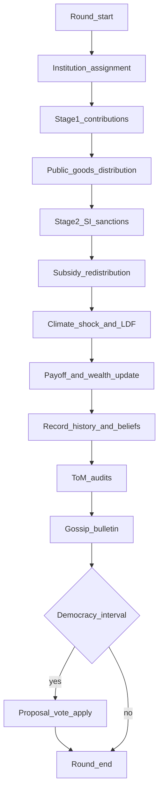
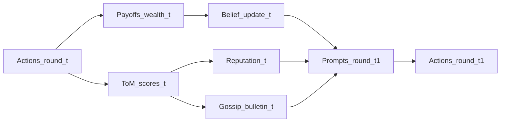
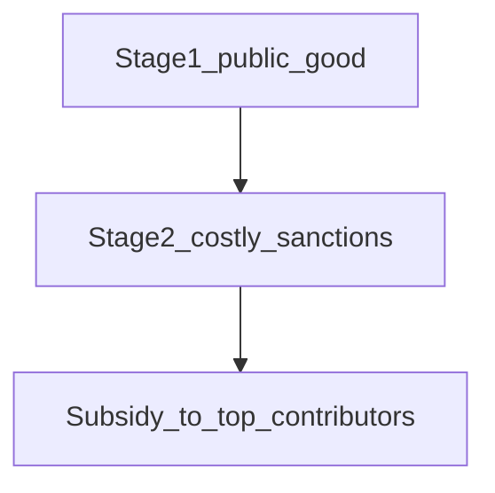
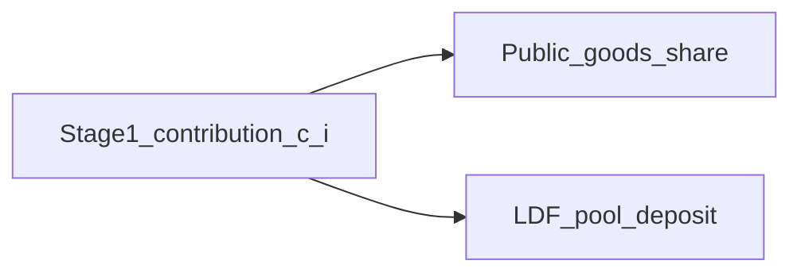

# 07 — Module Interaction Map (20260731)

How modules chain within and across rounds. Mermaid diagrams + textual flows.
No behavioural verdicts about the 20260731 run.

---

## Intra-round pipeline

Sources: `Environment.run_simulation`, `run_round`  
[Evidence: `src/core/environment.py` | run=n/a | round=n/a | agent=n/a | record=run_simulation]

---

## Cross-round information feedback

Notes:

- Gossip and updated reputation from round \(t\) enter prompts in round \(t+1\).
- Democracy rule changes (if any) alter live `parameters` for **subsequent** stages/rounds.
- LDF pool \(B\) evolves in the environment but is **not** fed into prompts as a number.

---

## Canonical narrative flow (requested chain)

Textual expansion of:

`observation → reasoning → contribution → reputation → gossip → proposal → vote → institutional change → later contribution`

| Step | Module | What happens |
|------|--------|----------------|
| Observation | Prompts + belief + T-1 peers + gossip | Agent sees bounded world state |
| Reasoning | LLM | Written into `*_reasoning` / belief fields |
| Contribution | Stage 1 | \(c_i\) chosen; also seeds LDF deposit |
| Reputation | ToM after round | Peer scores → mean \(\rho_i\) |
| Gossip | GossipModule | Low scores published to others’ next-round prompts |
| Proposal | Democracy (interval) | Agents propose parameter changes |
| Vote | Democracy | Plurality selects winning proposal |
| Institutional / rule change | `setattr(parameters, …)` | Live rule update (not SI↔SFI switch in LDF — membership stays group-forced) |
| Later contribution | Next rounds | New prompts under updated rules + social signals |

**LDF-mode caveat:** “Institutional change” in democracy means **parameter** change (sanction strength, subsidy, LDF payout weights, etc.), **not** free switching between SI and SFI. Membership remains developed→SI / developing→SFI.

---

## Enforcement and second-order structure (architecture only)

- Stage 2 enforcement is **costly** to senders (`PUNISHMENT_COST` / `REWARD_COST`).
- Subsidy recycles a fraction of SI punishment **token costs** to top contributors — an implemented transfer, not LLM-chosen.
- Whether agents free-ride on enforcement is an empirical Prompt 5 question; here only the mechanism is noted.

---

## LDF dual use of contribution

One decision variable \(c_i\) simultaneously funds the institution public good and (when collection is open) the LDF pool. Agents are **told** this dual use (**prompted**); they are **not** told \(B\).

[Evidence: `src/core/loss_damage_fund.py` | run=n/a | round=n/a | agent=n/a | record=_contribution_amount]  
[Evidence: `src/prompts/prompt_generator.py` | run=n/a | round=n/a | agent=n/a | record=_append_climate_role_guidance]

---

## Module dependency table

| Upstream | Downstream effect |
|----------|-------------------|
| Institution membership | Who faces Stage 2; group size / MCPR |
| Contributions | PG payoffs; LDF deposits; subsidy ranking; ToM inputs |
| Stage 2 allocations | Payoffs; subsidy pool; (indirect) later reputation via behaviour |
| Shock | Damages; LDF payouts; wealth |
| ToM | Reputation; gossip |
| Gossip / reputation / beliefs | Next-round prompts |
| Democracy | Parameter vector for future rounds |

---

## Implemented vs prompted vs not-emergent-here

| Claim type | Examples |
|------------|----------|
| Implemented | Forced SI/SFI routing; payoff math; LDF accounting; gossip filter; plurality apply |
| Prompted | Contribution levels; sanction targets; ToM scores; proposal text; belief labels |
| Not claimed in this document | Norm emergence; “stable cooperation”; real-world LDF effectiveness |
