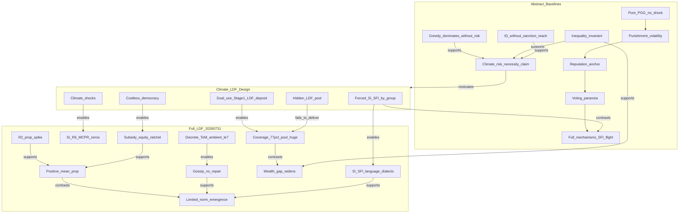

# 01 — Coherent Research Story and Connections Graph

**Purpose:** Pre-paper narrative spine for ELICIT / endogenous institutions and climate risk-sharing.  
**Not a manuscript.** Use this file to see how baseline studies, the locked Full LDF run (`20260731_013853`), architecture, behavioural findings, and selected literature lock together before drafting chapters.

**Draft status:** Sections 1–8 filled (Acts I–III + bridge). Sections 9–11 fill in the next commit.

---

## Table of contents

1. How to use this file  
2. Locked identities  
3. Core organising question  
4. Master connections graph  
5. Act I — Baseline story (abstract scenario)  
6. Act II — What climate/LDF changes in the architecture  
7. Act III — Full LDF run as connected mechanisms  
8. Baseline ↔ Full bridge table  
9. Claim node catalogue *(checkpoint 4)*  
10. What the paper may claim / must not claim *(checkpoint 4)*  
11. Open gaps that still block some paper sentences *(checkpoint 4)*  

---

## 1. How to use this file

Write paper sections only after you can point each paragraph to a **node** in §9 (once filled) or to an edge in §4 / bridge row in §8. Do not invent causal stories during drafting that are not already wired here.

### Claim-status legend

| Status | Meaning |
|--------|---------|
| **verified** | Direct support in tables/code/TEX for this project |
| **partial** | Directionally supported; material caveats |
| **interpretive** | Reasonable reading; not uniquely identified |
| **unsupported** | Contradicted or must not be asserted |
| **baseline-only** | Established in abstract baselines; not re-tested identically in Full LDF |
| **literature-hook** | External paper used as framing, not as empirical replication |

### Suggested reading order for paper drafting

1. §2 identities (what is comparable)  
2. §5 Act I (why climate/LDF was motivated)  
3. §6 Act II (what the Full design changes)  
4. §7 Act III (what happened)  
5. §8 bridge (baseline ↔ Full tensions)  
6. §10 claim boundaries  
7. §9 node catalogue as citation index while writing  

### Primary source map

| Layer | Paths |
|-------|--------|
| Full run memory | `docs/raw documentation/20260731/00_project_memory.md` |
| Full run synthesis | `synthesis/29_*.md`, `23_*.md`, `30_*.md`, `37_*.md` |
| Full run deep dives | `quantitative_analysis/08–10,31,34–36`; `qualitative_analysis/11–20,32`; `architecture/04–07,33`; `theory/24–28` |
| Baseline studies | `analysis_baseline_studies.tex` / `.pdf` |
| Literature (selective) | `literature/literature/Converted_Markdown/`; `literature/literature/essa lit/Converted_Markdown/` |

---

## 2. Locked identities

Two empirical layers must never be collapsed into one “the simulation.”

### Layer A — Abstract baselines (TEX)

- **Scenario:** abstract public-goods environment.  
- **Absent:** climate shocks; Loss & Damage Fund.  
- **Institution choice:** agents **freely** choose SI vs SFI each round (unless hardcoded greedy/random personas).  
- **Population variants:** Control, Reputation, Voting, Full (all mechanisms), Random, Greedy, Mixed (LLM + greedy).  
- **Scale (as reported in TEX):** typically ~7 agents; 20 rounds (mixed up to 30).  
- **Source of truth:** `analysis_baseline_studies.tex` §§Baseline Run 1–8 + Cross-Condition Synthesis.

### Layer B — Locked Full climate/LDF run (20260731 pack)

| Field | Value |
|-------|-------|
| Run | `simulation_llama3.1_8b_Full_scnldf_sh1_ldf1_seed1_26agents_30rounds_20260731_013853` |
| Model | `llama3.1:8b` (local Ollama) |
| Agents / rounds | 26 / 30 |
| Flags | Full; `scnldf`; shocks on; LDF on; seed 1 |
| Institution | **Forced:** developed → SI (12); developing → SFI (14) every round |
| Shocks | R5 sev 0.1; R10 sev 0.2 |
| Democracy | every 5 rounds (5…30) |
| Primary analyst metric | `prop_of_wealth = contribution / wealth_end_of_round` |

[Evidence: `00_project_memory.md` | run=20260731_013853 | round=n/a | agent=n/a | record=confirmed_analysis_run]

### Comparability rule (non-negotiable for the paper)

Baselines answer: *What do LLM agents do in a pure PGG with endogenous institutional choice and no climate redistribution?*  
Full LDF answers: *What happens when climate shocks + stylised LDF + forced SI/SFI routing are layered on the same family of modules?*  

You may **bridge** them (§8) as motivation and contrast. You may **not** treat Full-run SI vs SFI mean prop gaps as the same estimand as baseline free institutional sorting.

---

## 3. Core organising question

From the Full-run theory lock:

> **How can repeated interaction move a group from voluntary contribution, through social enforcement, toward institutional adaptation when collective resources, enforcement responsibilities, and redistribution mechanisms are imperfectly observed or controlled?**

[Evidence: `theory/24_behavioural_economics_interpretation.md` | run=20260731_013853 | round=n/a | agent=n/a | record=organising_question]

### What this question licenses

- Tracing contribution → reputation/ToM/gossip → Stage-2 enforcement → democracy parameter change under incomplete observation of the LDF pool.  
- Separating **positive average transfers** from **norm internalisation**.  
- Treating democracy as institutional adaptation (parameter drift), not as proof of Ostromian self-governance.

### What this question does *not* license

- Causal identification of SI vs SFI under forced routing.  
- Empirical evaluation of the real UNFCCC Fund for responding to Loss and Damage.  
- Claiming that baseline free-choice equilibria reappear unchanged under climate mode.

### Literature framing (hooks, not replications)

- Public-goods free-riding and costly sanctioning as classical dilemmas: *Corrupted by Reasoning… Free-Riders in Public Goods Games* (`essa lit/Converted_Markdown/Free riders in public game.md`) studies LLM institutional choice and costly sanctioning — closest external frame for SI/SFI + punishment.  
- Reasoning that can *reduce* cooperation (“calculated greed”): Li & Shirado, *Spontaneous Giving and Calculated Greed in Language Models* (`essa lit/.../Spontaneous Giving...md`) — relevant to Full-run MCPR-heavy zero templates.  
- LLM multi-agent strategic simulation frameworks: Alympics (`Converted_Markdown/2311.03220v4.md`) — methodological kinship for using LLM agents as game-theory laboratories.  
- Norm formation in LLM multi-agent systems: Gupta et al. AAMAS 2026 draft on social learning and collective norms (`essa lit/.../The Role of Social Learning...md`) — tension with Full-run **limited/mixed** norm verdict.

---

## 4. Master connections graph

Edges are interpretive but constrained by project evidence. Labels: **supports**, **contrasts**, **enables**, **fails_to_deliver**.

### How to read the graph for the paper

- Left column = **why** climate/LDF was introduced (baseline thesis).  
- Middle = **design interventions** that break baseline free-choice PGG.  
- Right = **measured Full-run outcomes**.  
- Critical tension edges: baseline “SFI flight under over-enforcement” **contrasts** Full forced SI/SFI; baseline inequality invariance **supports** Full widening wealth gap; hidden pool **fails_to_deliver** fund-stock optimisation even when coverage looks “okay.”

---

## 5. Act I — Baseline story (abstract scenario)

Narrative compressed from `analysis_baseline_studies.tex`. Status tags are **baseline-only** unless noted.

### 5.1 Setup: pure PGG, two institutions

Agents choose SI (Stage-2 punish/reward enabled) or SFI (no Stage-2). Pool multiplied and shared. Without shocks, the individually rational greedy strategy is contribute zero and stay in SFI — later proven by the hardcoded Greedy run.

[Baseline: TEX §Methodology — SFI/SI; §Baseline Runs 5&6 Greedy]

### 5.2 Control — cooperation without reputation

Pure LLM Control splits roughly 5 SI / 2 SFI early and stays relatively stable (lowest institution-switch volatility among pure LLM runs). Average contributions hover ~14 tokens. Findings that matter for later bridges:

1. **Punishment volatility / false defectors:** without public reputation, SI punish/reward swings wildly for similar contribution levels.  
2. **SFI paradox:** some SFI agents contribute substantially — LLM intrinsic cooperative bias / multiplier logic, not only fear of sanctions.  
3. **Reasoning–action gap:** agents rationalise staying in SI after punishment rather than pivoting.

[Baseline: TEX §Baseline Run 1]

**Connection forward:** Full LDF also shows cooperation talk with selfish zeros and template MCPR reasoning — same family of LLM artefacts, different institutional wiring.

### 5.3 Reputation — coordination anchor and regressive enforcement

Public EMA reputation pulls most agents into SI by mid-run. High reputation can coexist with SFI membership if contributions stay high (Agent 5: reputation 10 in SFI). Simultaneously, developing agents are punished for **absolute** shortfalls despite proportional effort — wealth collapses for some developing SI members.

[Baseline: TEX §Baseline Run 2 + Table of R20 disparities]

**Connection forward:** Full run forces developing agents into **SFI** (no Stage-2), partly removing that particular regressive SI punishment channel — but inequality returns through endowment + PG returns + thin LDF relative to wealth stocks (§7/§8).

### 5.4 Voting without reputation — paranoia

Worst collective LLM baseline wealth (~1007). Voting on rules without trust metrics amplifies suspicion; developing SI agents can be destroyed by Stage-2; exit to SFI can dominate for some.

[Baseline: TEX §Baseline Run 3]

**Connection forward:** Full-run democracy is **parameter whitelist** voting with forced membership — different object. Full democracy produces a **reward/equity ratchet**, not the baseline voting catastrophe, but still shows cheap meta-governance and cooperative boilerplate.

### 5.5 Full abstract mechanisms — SFI-majority paradox

Layering Reputation + Voting + Gossip + enhanced enforcement yields flight from SI into SFI by high contributors who no longer need punish risk. Remaining SI agents show **false-defector attribution**.

[Baseline: TEX §Baseline Run 4]

**Connection forward (contrast):** Climate mode **forbids** this flight for developed/developing groups. Full LDF therefore cannot reproduce the “voluntary SFI cooperation equilibrium”; it tests forced asymmetric enforcement rights instead.

### 5.6 Random and Greedy counterfactuals

- Random ≈ Control on collective payoff — LLM punishment friction can erase cooperative advantage.  
- Greedy all-zero SFI: **highest** individual wealth of 20-round runs; zero switches. **Without climate risk, defection wins.**

[Baseline: TEX §Baseline Runs 5&6]

### 5.7 Mixed LLM + Greedy — identification without reach

LLMs correctly label greedy SFI free-riders via ToM/gossip but **cannot sanction** them across the institutional boundary. They intensify a closed SI cooperative economy while greedy SFI agents earn most.

[Baseline: TEX §Baseline Runs 7&8]

**Connection forward:** Full LDF again places developing agents in SFI and developed in SI — structurally similar *asymmetric sanction reach*, now with climate transfers aimed at developing agents.

### 5.8 Baseline synthesis thesis

TEX concludes: inequality is invariant across abstract mechanisms; LLM play shows reasoning–action gaps and punishment myopia; **endogenous cooperation needs existential (climate) risk and redistributive necessity (LDF)** to become more than intrinsic LLM bias / irrational cooperation.

[Baseline: TEX §Cross-Condition Synthesis and Thesis Implications]

**Literature tension:** Li & Shirado show *more* reasoning can *reduce* cooperation — so “adding climate prompts + MCPR salience” may increase calculated free-riding even as risk rises. Full-run R6 SI zeros citing MCPR are the empirical place this tension bites.

---

## 6. Act II — What climate/LDF changes in the architecture

These are **design facts** of the locked Full run, not behavioural discoveries. Sources: architecture docs 04–07, 33; memory; `loss_damage_fund.py`.

### 6.1 Forced institutional partition

Climate/LDF mode assigns developed→SI and developing→SFI every round. Institution reasoning often echoes the routing string itself.

**Semantic consequence:** “institutional choice” ceases to be an endogenous outcome. SI vs SFI comparisons are collinear with `agent_group` and wealth.

[Evidence: `architecture/06_agent_information_boundaries.md` | run=n/a | round=n/a | agent=n/a | record=climate_mode_forced]  
[Evidence: `qualitative_analysis/16_institutional_choice_si_vs_sfi.md` | run=20260731_013853 | round=n/a | agent=n/a | record=forced]

**Edge vs baseline:** **contrasts** free SI/SFI sorting and the Full-abstract SFI-flight equilibrium.

### 6.2 Dual-use Stage-1 → LDF deposit

`LossDamageFund._contribution_amount` equals the agent’s Stage-1 contribution. One number funds both the institutional public good and the LDF pool.

**Semantic consequence:** agents cannot separately “pledge to LDF” vs “contribute to SI/SFI PG.”

[Evidence: `src/core/loss_damage_fund.py` | run=n/a | round=n/a | agent=n/a | record=_contribution_amount]

### 6.3 Hidden numeric pool; visible own flows

Agents see own LDF contribution, payout, and damage. They do **not** see `ldf_pool_start/end`. Fund-adequacy language is rare (~1.8% of contribution blocks in the deepening pass).

[Evidence: `architecture/33_semantic_module_connections.md` | run=20260731_013853 | round=n/a | agent=n/a | record=hidden_pool]  
[Evidence: `quantitative_analysis/35_ldf_coverage_and_transfers.md` | run=20260731_013853 | round=n/a | agent=n/a | record=fund_language]

**Edge:** architecture **enables** pool growth; semantics **fails_to_deliver** fund-stock strategy.

### 6.4 Shocks and democracy on a shared calendar

Shocks at R5/R10 coincide with democracy sessions. Any “shock effect” is confounded with rule politics.

[Evidence: `00_project_memory.md` | run=20260731_013853 | round=5,10 | agent=n/a | record=shocks_democracy]

### 6.5 Costless democracy as meta-enforcement

Proposals/votes cost no Stage-2 tokens. Democracy can reshape subsidy and LDF weights without paying for peer punishment — a cheap substitute for the second-order public good of enforcement.

[Evidence: `qualitative_analysis/17_enforcement_as_public_good.md` | run=20260731_013853 | round=n/a | agent=n/a | record=democracy_substitute]

### 6.6 Real-world LDF motivation (external, verified)

Fund/funding arrangements established COP27 (2/CP.27); operationalised COP28 (1/CP.28 Governing Instrument + Board; World Bank interim FIF). Simulation is a **mechanism lab**, not a calibrated Party model.

[Evidence: `theory/26_ldf_context_and_multi_agent_motivation.md` | run=n/a | round=n/a | agent=n/a | record=COP_timeline]  
[Evidence: `theory/28_external_sources.md` | run=n/a | round=n/a | agent=n/a | record=E1-E5]

### 6.7 Act II bridge sentence (for the paper intro)

Baselines showed that without climate risk, greedy free-riding dominates and formal mechanisms can mis-fire or become redundant; climate mode therefore *imposes* asymmetric institutions and a redistributive fund — but it also removes free institutional choice and hides the fund stock, so the Full run tests a **different** strategic object than the baselines.

---

## 7. Act III — Full LDF run as connected mechanisms

Chronological spine first, then thematic mechanisms. All quantities are for `20260731_013853` unless noted. This section is the **story of what happened**; §8 compares it to baselines; §9 will atomise claims.

### 7.1 Cold start → R2 spike (conditional cooperation vs prompt artefact)

**Facts.** Overall mean `prop_of_wealth` jumps 0.231 → 0.445 from R1 to R2. SFI mean prop jumps 0.022 → 0.602; SFI R1 zero share is 71.4%. R1 zero reasoning emphasises conservation and observation (“assess future opportunities,” “no prior experience”).

[Evidence: `quantitative_analysis/31_zero_contribution_episodes.md` | run=20260731_013853 | round=1-2 | agent=n/a | record=r2_spike]  
[Evidence: `qualitative_analysis/32_zero_contribution_reasoning.md` | run=20260731_013853 | round=1 | agent=0,9,24 | record=cold_start]

**Connection.** Once R1 peer history enters prompts, many SFI agents escalate — compatible with **conditional cooperation**, but also with **cold-start artefact** (thin context → caution). Later full-path peer-prev correlations are weak (SI≈0.05, SFI≈−0.09), so R2 is not proof of stable CC for the whole run.

[Evidence: `synthesis/37_additional_research_answers.md` | run=20260731_013853 | round=n/a | agent=n/a | record=Q12_Q21]

**Literature hook.** Conditional cooperation is the classical PGG mechanism; LLM “calculated greed” literature warns that explicit MCPR/payoff reasoning can later reverse early cooperative bursts (Li & Shirado; Free-riders/PGG LLM papers in §3).

### 7.2 Positive average cooperation without strong norms

**Facts.** Overall mean prop ≈ 0.293; median ≈ 0.092. SI mean ≈ 0.291 vs SFI ≈ 0.296 (negligible mean gap) but SFI median 0.034 and higher zero share. Prompt 7: **limited/mixed** norm emergence; **moderately positive average cooperation with limited path stability** (group-mean autocorr ≈ 0.03).

[Evidence: `synthesis/21_norm_emergence_assessment.md` | run=20260731_013853 | round=n/a | agent=n/a | record=verdict]  
[Evidence: `synthesis/22_cooperation_stability_assessment.md` | run=20260731_013853 | round=n/a | agent=n/a | record=verdict]  
[Evidence: `tables/prompt3_numeric_summary.json` | run=20260731_013853 | round=n/a | agent=n/a | record=si_sfi]

**Connection.** This is the Full-run analogue of the baseline “SFI paradox / intrinsic LLM cooperation”: transfers happen, but obligation language is weak (fairness/reciprocity ≈ 0 in shared kinds). Paper must keep **levels** and **norms** separate.

### 7.3 Shock window — SI R6 MCPR zero bloc

**Facts.** After R5 shock (and democracy), SI zero share at R6 = 41.7% (agents 2, 3, 5, 6, 14). Stated reasons are payoff-max / low MCPR templates, not “cannot afford” — end-of-round wealth remains large. Other SI agents continue contributing.

[Evidence: `quantitative_analysis/31_zero_contribution_episodes.md` | run=20260731_013853 | round=6 | agent=2,3,5,6,14 | record=si_r6]  
[Evidence: `qualitative_analysis/32_zero_contribution_reasoning.md` | run=20260731_013853 | round=6 | agent=2 | record=excerpt]

**Connection.** Shock **disturbs composition**; mean prop recovers within 1–2 rounds (Prompt 7), so this is not permanent unraveling — but it is the clearest Full-run instance of **calculated free-riding** under MCPR salience. Shock–democracy calendar overlap prevents clean causal attribution to climate damage alone.

### 7.4 Social enforcement fails as repair — reputation, gossip, ToM

**Facts.**

- Bad-rep / gossip-target events: mean Δ prop **negative** (e.g. SFI gossip imm ≈ −0.20).  
- Gossip targets have high mean prop at event (~0.52); ranks mid-pack.  
- ToM scores discrete: 5.0 and 1.0 dominate; **84%** of scores ≤ 7 → gossip threshold nearly ambient.  
- Explicit repair language rare; opportunistic/MCPR talk more common.

[Evidence: `qualitative_analysis/11_reputation_and_gossip_events.md` | run=20260731_013853 | round=n/a | agent=n/a | record=event_study]  
[Evidence: `tables/prompt_dashboard_rq_summary.json` | run=20260731_013853 | round=n/a | agent=n/a | record=tom_gossip]

**Connection.** Baseline mixed-pop already showed **identification without sanction reach**. Full LDF adds: even *within* the social-information channel, naming does not raise contribution. Semantic architecture: gossip partly redundant for SI Stage-2 visibility; more unique for SFI.

[Evidence: `architecture/33_semantic_module_connections.md` | run=20260731_013853 | round=n/a | agent=n/a | record=gossip_edge]

### 7.5 Costly enforcement uneven; democracy substitutes with carrots

**Facts.** Stage-2 only in SI; corr(prop, enforcement tokens) ≈ 0.14; top-quartile prop agents pay ~35% of tokens. Sanction hubs: givers 25, 2, 14, 3, 22; receivers 14, 10, 6, 16, 22. Democracy adopts subsidy↑ and LDF equity/damage↑; **fails** two punishment-weakening proposals. Proposal reasons are cooperation boilerplate.

[Evidence: `qualitative_analysis/17_enforcement_as_public_good.md` | run=20260731_013853 | round=n/a | agent=n/a | record=burden]  
[Evidence: `qualitative_analysis/14_proposal_trends.md` | run=20260731_013853 | round=n/a | agent=n/a | record=adopted_path]  
[Evidence: `quantitative_analysis/36_beliefs_and_sanction_structure.md` | run=20260731_013853 | round=n/a | agent=n/a | record=hubs]

**Connection.** Second-order free-riding tension persists. Unlike baseline Voting-without-reputation catastrophe, Full democracy is thin (14 proposals) and **directional** toward rewards/redistribution parameters — a ratchet, not chaos.

### 7.6 LDF: coverage without equalisation

**Facts.** Shock coverage ≈ 0.768 at R5 and R10. Cumulative payouts ~8.5e5 vs terminal pool ~4.34e9. Developed–developing mean wealth gap widens ~4.6e6 → ~2.15e8. Belief free-rider labels (~13%) outnumber cooperative (~8%).

[Evidence: `quantitative_analysis/35_ldf_coverage_and_transfers.md` | run=20260731_013853 | round=5,10 | agent=n/a | record=coverage]  
[Evidence: `quantitative_analysis/34_wealth_gini_and_cooperation_rate.md` | run=20260731_013853 | round=1,30 | agent=n/a | record=wealth_gap]

**Connection.** Baseline TEX claimed inequality invariance without LDF; Full run shows LDF **pays developing damage partially** but does **not** close wealth stocks — because absolute SI contributions and endowments dwarf payouts. “Collection ≠ effective redistribution” is the political-economy punchline (theory 26).

### 7.7 Language dialects without fairness norms

**Facts.** SI keyness: strategy / self-interest / follow / payoff. SFI: incentives / immediate / long-run. Fairness appears mainly in SI **punishment** blocks; SFI_fair examples empty in Prompt 6.

[Evidence: `qualitative_analysis/19_si_sfi_language_comparison.md` | run=20260731_013853 | round=n/a | agent=n/a | record=keyness]

**Connection.** Forced routing + role prompts produce **dialects**, not identified preference types. Supports limited-norm verdict.

### 7.8 Act III one-paragraph spine (paste into paper outline)

Under forced SI/SFI and a hidden dual-use LDF, llama3.1:8b agents generate positive average proportional contributions that spike once peer history appears, dip into MCPR-justified SI zeros after the first shock, fail to repair after gossip/bad reputation, drift democratic parameters toward subsidies and LDF equity, and leave the developed–developing wealth gap widening despite ~77% damage coverage — cooperation as transfers without internalised norms, and redistribution without equalisation.

---

## 8. Baseline ↔ Full bridge table

| Theme | Baseline (TEX) | Full LDF 20260731 | Connection | Paper implication |
|-------|----------------|-------------------|------------|-------------------|
| Institutional choice | Free SI/SFI sorting; Full-abstract → SFI flight by high contributors | Forced developed→SI, developing→SFI | **contrasts** | Do not cite Full SI/SFI means as institutional preference |
| Cooperation without sanctions | SFI contributors exist (Control, Reputation Agent 5, Full-abstract migrants) | SFI mean prop ≈ SI; many SFI zeros + bursts | **supports** (LLM can give without Stage-2) | Separate “can cooperate” from “will enforce” |
| Greedy optimum without risk | All-greedy: highest wealth; zero contrib dominant | Positive mean prop under shocks/LDF | **motivates** Full design | Climate/LDF as survival/redistribution pressure — but Full still has MCPR zeros |
| Reputation as repair | Public scores become objectives; high rep possible in SFI | Bad-rep/gossip → mean Δ prop negative | **contrasts / fails** | Full social info ≠ image-repair mechanism here |
| Identification of free-riders | Mixed: ToM/gossip label greedy; cannot punish across SFI | ToM discrete; gossip often hits high-prop agents | **partial continuity** | Monitoring ≠ correct targeting ≠ behavioural repair |
| Punishment regressivity | Developing SI crushed by absolute-contribution norms | Developing forced to SFI (no Stage-2); SI bears enforcement | **design response** | Forced SFI protects developing from SI punish — tradeoff: no peer sanction on SFI free-ride |
| Voting / democracy | Voting-without-rep → paranoia, worst wealth | Sparse democracy; subsidy/equity ratchet; punish-weaken fails | **different object** | Full democracy = parameter politics, not baseline voting war |
| Reasoning–action gap | Plans vs numbers diverge; rationalise punishment | Coop/free-ride language vs zeros; MCPR templates | **supports** | Method finding about LLM agents, not only climate |
| Inequality | Wealth gap persists across all abstract mechanisms | Gap **widens** despite LDF coverage | **supports + intensifies** | LDF stylisation insufficient for stock equalisation |
| Over-enforcement / SFI haven | Full-abstract: flee SI when rep strong | Cannot flee; SI stuck with Stage-2 costs | **contrasts** | Forced membership creates asymmetric burden (doc 24 tax theme deferred) |
| Second-order enforcement | Implicit in SI punishment volatility | corr~0.14; hubs; costless democracy substitute | **supports** | Enforcement as public good is paper-ready |
| Norm emergence | Not primary TEX verdict; intrinsic bias noted | Explicit limited/mixed + path-unstable coop | **Full adds measurement** | Use Prompt 7 twin verdicts |
| Climate necessity thesis | TEX conclusion: need shocks + LDF | Full implements both; mixed behavioural success | **tests** | Thesis partially confirmed (coop persists) and partially strained (norms weak; gap widens; gossip fails) |

---

## 9. Claim node catalogue

*(Pending — checkpoint 4)*

## 10. What the paper may claim / must not claim

*(Pending — checkpoint 4)*

## 11. Open gaps that still block some paper sentences

*(Pending — checkpoint 4)*
