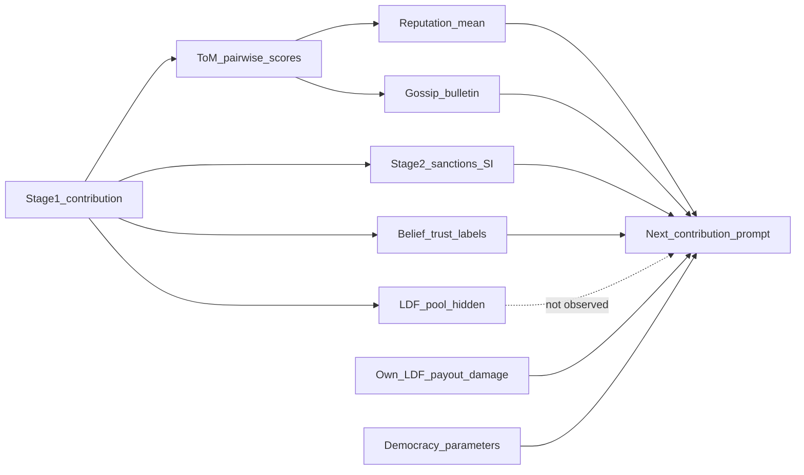

# 33 — Semantic Module Connections (20260804)

[`07_module_interaction_map.md`](07_module_interaction_map.md) shows **control flow** (what runs after what). This document shows **semantic coupling**: what each module *means* to an agent, what information crosses the edge, the timing lag, and what the 20260804 run suggests about behavioural consequence.

Cross-links: [`06_agent_information_boundaries.md`](06_agent_information_boundaries.md), [`04_system_architecture.md`](04_system_architecture.md).

---

## Architectural vs semantic coupling

| Edge | Architecturally connected? | Semantically available to agent? | 20260804 consequence |
|------|----------------------------|----------------------------------|------------------------|
| Stage-1 contribution → LDF pool deposit | Yes (dual-use) | Pool **balance** not shown; own deposit/payout/damage shown | Cannot optimise against fund stock; fund language in only ~1.8% of contribution texts |
| LDF pool → payouts | Yes | Own payout only | Coverage ~77% at shocks; huge residual pool unused as decision signal |
| Contribution → ToM scores | Yes | Scorer sees peer history; scored agent sees own reputation later | ToM highly discrete (many 5s/1s); 84% of scores ≤7 |
| ToM → reputation mean | Yes | Own ρ visible next round | Bad-rep events → mean Δ prop **negative** |
| ToM → gossip bulletin | Yes | Personalized top-5 ≤7; `"YOU"` label | Gossip targets often mid/high prop; mean Δ prop negative; almost no “gossip” token in reasoning |
| Gossip → Stage-2 (SI) | Weak | SI already sees peer contrib/deviation | Gossip partly **redundant** for SI punish; more informative for SFI |
| Stage-2 → subsidy pool | Yes | Indirect | Democracy raises subsidy fraction — carrot politics |
| Democracy → parameters | Yes | Free to propose/vote | Costless meta-governance substitutes for costly enforcement |
| Forced institution → prompts | Yes | Agents recite routing facts | No semantic “choice” of SI/SFI |

---

## Semantic feedback graph

Dashed edge = architectural write without semantic read.

---

## Edge-by-edge meaning

### 1. Contribution → ToM (“was this agent trustworthy?”)

**Meaning to scorer:** LLM judges peers, often collapsing to extreme bins (score 5: 12,647; score 1: 2,370 of 18,850).  
**Lag:** after round actions.  
**Behavioural note:** first impressions (R2 first non-empty ToM) can path-depend reputation (RQ 4 deferred for full partials; distribution shape answered in RQ index).

[Evidence: `tables/prompt_dashboard_rq_summary.json` | run=20260804_024555 | round=n/a | agent=n/a | record=tom_gossip]

### 2. ToM → gossip (“who is socially flagged?”)

**Meaning:** lowest scores ≤7, top 5 — but **84%** of all scores are ≤7, so the threshold is nearly ambient rather than rare indictment.  
**Lag:** bulletin compiled after t; read at t+1.  
**Behavioural note:** targets’ mean prop at event ≈0.52; mean Δ afterward negative (doc 11). Semantic intent “discipline free-riders” ≠ observed selection.

### 3. Reputation → next contribution

**Meaning:** scalar social image in prompt.  
**Observed talk:** rare explicit repair; more MCPR/payoff (docs 11, 32).  
**Consequence:** not a reliable upward stabiliser.

### 4. Stage-2 sanctions → payoffs / beliefs

**Meaning:** costly moralistic aggression / reward inside SI.  
**Talk:** “punish free-riders… fairness” (doc 17).  
**Consequence:** uneven provision; democracy prefers carrots.

### 5. Belief trust_levels → perception

**Meaning:** categorical labels of peers. Dashboard buckets: default 79%, free-rider 13%, cooperative 8%.  
**Consequence:** free-rider labelling is common relative to cooperative labelling, yet contribution norms stay weak — labels do not equal repaired cooperation.

[Evidence: `tables/belief_trust_buckets.csv` | run=20260804_024555 | round=n/a | agent=n/a | record=buckets]

### 6. LDF pool (hidden) vs own flows (visible)

**Semantic hole:** agents can know they were under-covered relative to own damage, but cannot see whether the fund is rich or poor globally. Final pool ~4.34e9 with cumulative payouts only 8.5e5 — externally the fund is flush; internally agents almost never discuss pool adequacy.

### 7. Democracy as semantic override

Changing `SUBSIDY_FRACTION` or `LDF_EQUITY_WEIGHT` rewrites the payoff meaning of prior Stage-2 and LDF modules without requiring agents to re-negotiate informal norms. That is why formal rules can drift while obligation language stays thin (Prompt 7).

---

## Summary thesis

Modules are tightly wired in code, but **meaning is sparse and lagged**. The strongest semantic channels in agent text are MCPR/payoff and institution strategy templates; the weakest are fund adequacy, gossip acknowledgement, and fairness-as-contribution-obligation. Behavioural results (no repair after gossip; dual-use hidden pool; reward ratchet) follow from that semantic thinness as much as from the architectural diagram.
